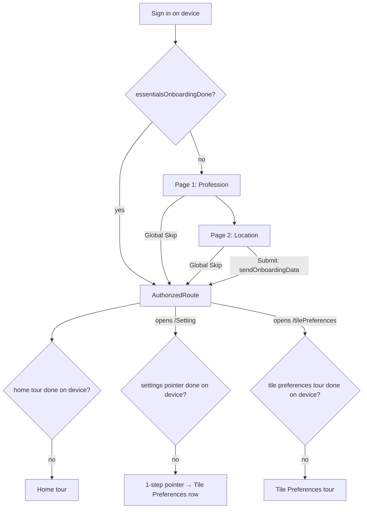

# Product Tour & Slim Onboarding Redesign

Replaces the blocking 10-page onboarding questionnaire with a 2-page
"essentials" flow plus contextual product tours. Users reach the schedule
minutes earlier; learning happens in context.

Development follows TDD: write failing test -> implement -> pass ->
analyze -> refactor. Update the tracker after every red-green-refactor cycle.

Last updated: 2026-09-16

**Resume point (pause/error recovery):** Phases 1–3 complete (commits
`711af31` phase 1, `a10302e` phase 2, `aec0f74` stage 2.4, `70d643c` phase 3).
2026-09-12 review retargeted the in-app product tour from the Settings list
to the **Tile Preferences** page (section 3.4); stage 2.5 landed it, and
stage 3.5 (schedule prefetch during onboarding) followed (`ecf5ab9`). Stage
4.1 + 5.2 + the overlay remount fix landed in `59f771e`; the day-carousel
remount fix (3.5 cycle 2) in `a4bd471`; 4.2 in `07686ef`. Stage 4.4
(explainer) landed in `ee758ab`; demo relocation, badges and decommission
landed in `04b808a8`, with documentation in `a369cf22`. Stage 5.1 is
committed in `625f6f08` (shared analytics consolidation included).
Stage 5.3 automated display checks are green; accessibility layout fixes are
uncommitted for review. Next: Android/iOS manual QA and production analytics
delivery verification.
Resume protocol: (1) read this block, (2) the section 9 tracker row for
the next stage, (3) the newest section 10 cycle entry. The tracker and
cycle log are updated in the same commit as the code, so a mid-stage
pause or error shows up as a stage still marked `Red`/`Green` with no
matching commit — re-run that stage's tests to locate the break.

---

## 1. Decisions (locked)

| Topic | Decision |
| --- | --- |
| Full 10-page onboarding | Cut to a 2-page essentials flow |
| Essentials pages & order | 1. Profession (job description) → 2. Location |
| Skip | One **global Skip** on both pages; terminal; discards unsubmitted data |
| Submit | Single atomic submit on final page only |
| Intro slider (`OnBoardingDescriptionSlider`) | Deleted (stage 4.3) — replaced by a single animated **Tiles vs Blocks** demo shown right after the essentials pages, on Submit and on Skip (stage 4.4); the home tour covers the rest |
| Onboarding gate | Local flag only (`essentialsOnboardingDone`); no blocking server round-trip |
| Sign-in tour | None |
| Home tour | Six Home UI steps; does not open or close the add-tile sheet |
| Add-tile tour | Quick Add and Smart Scheduling, triggered by tapping the center Tiler button in HomeBottomNav; independent completion and replay |
| Settings-list pointer | 1 step; first visit to `/Setting`; points at the Tile Preferences row (discovery only) |
| Tile Preferences tour | New; 3 steps (transport, work/personal hours, block-out hours); first visit to `/tilePreferences`. This is the tour that teaches how to update AI preferences |
| Tour frequency | **Once per Tiler device** (SharedPreferences; survives logout; replays on reinstall/new device) |
| Existing-user seeding | None — everyone gets the settings tour once per device |
| Manual replay | Settings › "How to use Tiler" resets tours per device |

## 2. Current state (references)

- Full onboarding: `lib/routes/authentication/onBoarding.dart` (10 pages),
  `lib/bloc/onBoarding/on_boarding_bloc.dart` (`numberOfPages = 9`, hardcoded
  page indices 4/5/6/7), `lib/services/api/onBoardingApi.dart`,
  `lib/services/onBoardingHelper.dart` (`skipOnboarding` prefs flag).
- Gate: `Utility.checkOnboardingStatus()` in `lib/util.dart` =
  `skipOnboarding || areRequiredFieldsValid()` (server round-trip). Called from
  `main.dart`, `signInComponent.dart` (×6), `welcomeScreen.dart`.
- Tour engine (single-tour today): `lib/components/tutorial/*`
  (`tutorialOverlay.dart` with `buildTutorialSteps` + `kTutorialStepCount`,
  `tutorialStep.dart`, `tutorialKeys.dart`, `tutorialTooltipWidget.dart`,
  `tutorialDummyData.dart`), `lib/bloc/tutorial/tutorial_bloc.dart`,
  `lib/services/tutorialPreferencesHelper.dart`
  (`hasCompletedAppTutorial`), `_TutorialWrapper` in
  `lib/routes/authentication/AuthorizedRoute.dart`.
- Settings page: `lib/routes/authenticatedUser/settings/settingsWidget.dart`
  (`_buildListTile` rows: Account Info, Tile Preferences, Notifications,
  Connections, Feedback, Logout).

## 3. Target design

### 3.1 Flow

### 3.2 Essentials onboarding

- Page 1 — Profession: existing `ProfessionWidget` (checkbox list + "Other"
  free text, 3-char validation). Feeds server personalization; the tile
  suggestions page is cut from onboarding.
- Page 2 — Location: merge of `PrimaryLocationWidget` (address search) and the
  device-location consent from `TimeAndLocationWidget` as an in-page button
  (button-driven `GetTimeAndLocationEvent` — fixes the swipe-forces-location
  bug on today's page 4). Both inputs optional.
- Bloc cleanup: page count 2; remove hardcoded index logic (==4/5/6/7);
  restriction-profile fetch/save leaves onboarding (owned by Settings);
  wake-up/energy/workday/work-profile/personal-profile/suggestions/usage
  pages removed from the flow.
- Submit path: `sendOnboardingData` with profession + location (+ optional
  device coords/timezone) only. Skip = `SkipOnboardingEvent` -> flag -> app.
- Schedule prefetch (stage 3.5): `primeScheduleAfterLogin(context)`
  (`lib/services/schedulePrimer.dart`) fires LogIn → GetSchedule (initial
  window, fresh) → day summary as soon as credentials verify, *before* the
  onboarding gate, so the schedule loads while the essentials pages show.
  Submit's buzz revises the schedule server-side, so once the buzz
  completes the view asks the `ScheduleBloc` for a quiet forced refresh
  (`forceRefresh` + `emitOnlyLoadedStated`); navigation never waits on the
  buzz. A failed buzz revised nothing → no refresh. Skip never buzzes.
- Data recapture: Settings › Tile Preferences (hours, locations, profiles).

### 3.3 Multi-tour engine

- `TourDefinition { tourId, stepsBuilder(context), triggerPolicy }` in a
  small registry. Existing `buildTutorialSteps` becomes the `home` builder.
- `TutorialBloc` parameterized by `tourId`; completion/skip persists
  `hasCompletedTour_<tourId>`. Migration: `hasCompletedAppTutorial == true`
  maps to `home` completed.
- `TourHost` widget extracted from `_TutorialWrapper`: per-tour completion
  check -> post-frame settle delay -> `StartTutorialEvent`.
- One-tour-at-a-time guard (in-memory coordinator). A tour blocked from
  starting is not marked complete; it retries on next surface visit.
- `TutorialOverlay` generalized to render any tour's steps;
  the add-tile sheet owns a separate `add_tile` tour started on user entry.

### 3.4 Tour steps

**Settings-list pointer** (`settings` tour, 1 step) — discovery only:

| # | Anchor | Message |
| --- | --- | --- |
| 1 | Tile Preferences row | Your AI preferences live here — how you travel, your work/personal hours, and block-out time |

**Tile Preferences tour** (`tile_preferences` tour, 3 steps) — anchors are
the three section cards in `tilePreferences.dart`. The template's Save
button is not a step: it only renders once `hasChanges` is true, so it does
not exist when the tour runs.

| # | Anchor (new GlobalKeys) | Message |
| --- | --- | --- |
| 1 | Transport card | How you get around — Tiler budgets travel time between tiles from this |
| 2 | Work / Personal hours card | When Tiler may schedule work vs. personal tiles; tap either to set a profile |
| 3 | Block-out hours card | Bed time and sleep — hours Tiler never schedules into |

Engine requirements surfaced by this page (both generic, in `TourHost`):

- **Anchor readiness gate.** The page shows `PendingWidget` until
  `PreferencesLoaded`; a timer-based start would spotlight nothing.
  `TourHost` polls from mount until step 1's `targetKey` is mounted, then
  starts at `max(settleDelay from mount, anchorSettleDelay from the anchor
  appearing)` — the loaded page stays undimmed for a beat (800ms default)
  instead of dimming on the same frame the spinner disappears, which
  on-device read as "the tour began before the page loaded". On timeout it
  gives up *without* marking the tour complete, so it retries on the next
  visit (same semantics as a coordinator block).
- **Scroll-into-view.** The page content is a non-scrolling `Column`; on
  small viewports the block-out card can sit below the fold. Content gets a
  scroll view and the overlay calls `Scrollable.ensureVisible` on the
  current step's anchor before measuring the spotlight. Minimal scroll
  only (`keepVisibleAtEnd` then `keepVisibleAtStart`): a fully visible
  anchor never moves, so home-tour parity holds.
- **Bounded tooltip slot.** The tooltip used to be placed from a fixed
  320px height estimate and, when neither side "fit", pinned to the top of
  the screen while still constrained above the cutout — a tall anchor
  (the transport card) left it ~30px of height and it overflowed.
  `computeTooltipSlot` now picks the side that can hold a usable card
  (≥ 200px), bounds the card to that band so it shrinks (its body already
  scrolls) instead of overflowing, hugs the cutout, and only when neither
  side has room floats over the spotlight.

History: 2.1–2.3 originally shipped a 4-step Settings-list tour (Account
Info / Tile Preferences / Notifications / Connections). Reviewed 2026-09-12
and cut to the 1-step pointer above: the list rows are self-explanatory,
and the learning users actually need is on the Tile Preferences page.

### 3.4b Tiles vs Blocks demo (stage 4.4)

Every exit from the essentials pages — Submit and Skip alike — replaces
the onboarding route with `OnboardingExplainerScreen`
(`lib/routes/authentication/onboardingExplainerRoute.dart`): headline,
`TilesVsBlocksExplainer` (`lib/components/welcome/`) and a "Let's Go!"
button that replaces the whole stack with `AuthorizedRoute`. No auto-route;
the user reads at their own pace. `WelcomeScreen` is untouched (the 4.2
beat for everyone). Submit's post-buzz schedule refresh (3.5) is unaffected:
the schedule bloc is captured before navigation.

The explainer is built in Flutter (no Lottie asset) so captions and card
labels are localised and colours follow the theme. A mini day timeline
(9:00–16:00) plays three 2s beats, then holds:

| Beat | What moves | Caption |
| --- | --- | --- |
| blocks | "Team standup" 9:00 and "Dentist" 14:00 drop in with a pin | Blocks are fixed. They happen at a set time. |
| tiles | "Workout", "Write report" (2h), "Groceries" slide into the gaps | Tiles are flexible. Tiler fits them around your blocks. |
| replan | Dentist card first announces the change ("Moved" badge + highlight, first 20% of the beat), then jumps to 11:00; the report and groceries tiles re-seat around it, each picking up a Tiler mark ("Re-planned" + the app's `auto_awesome` AI glyph) as it moves — the untouched workout tile gets none | Dentist moved to 11:00 — Tiler re-plans your tiles around it. (time in the device format) |

`MediaQuery.disableAnimations` shows the final frame immediately.

### 3.5 Gate simplification

- `checkOnboardingStatus()` becomes a local prefs read (legacy
  `skipOnboarding` OR new `essentialsOnboardingDone`); drop the
  `areRequiredFieldsValid()` server call from the critical path.
- Optional non-blocking background reconcile with the server onboarding
  record for reinstall cases (nice-to-have; Phase 4).
- Backend must tolerate absent onboarding content (already returns 404 →
  defaults; verify scheduling defaults acceptable).

## 4. Phases

### Phase 1 — Multi-tour engine foundation
1. `TourPreferencesHelper`: per-tour keys + legacy migration.
2. `TutorialBloc` gains `tourId`; completion/skip writes per-tour key.
3. `TourHost` extracted; `home` tour re-wired through it (behavior parity).
4. Tour coordinator: one active tour at a time.

### Phase 2 — Settings tour (superseded — see 2.5)
1. GlobalKeys on settings list tiles.
2. `settings` `TourDefinition` (4 steps) + l10n strings (en + es).
3. `TourHost` wired into the Settings scaffold.
4. "How to use Tiler" reset extended to per-tour / replay-all.
5. **Retarget (2026-09-12):** `settings` tour cut to a 1-step pointer at the
   Tile Preferences row; new `tile_preferences` tour (3 steps) hosted on the
   `/tilePreferences` route; `TourHost` anchor-readiness gate +
   scroll-into-view; registry `[home, settings, tile_preferences]`.

### Phase 3 — Slim essentials onboarding
1. Reduce `pages` to [Profession, Location]; profession validation keyed to
   "is profession page", not index 7.
2. Location page: merge address search + consent button; remove auto
   `GetTimeAndLocationEvent(true)` on swipe.
3. Submit → `AuthorizedRoute` directly (intro slider cut); Skip unchanged
   semantics, sets flag.
4. Remove restriction-profile calls from onboarding fetch/submit.
5. Schedule prefetch: prime the schedule before the gate on both launch
   paths; quiet refresh after Submit's buzz completes.

### Phase 4 — Gate simplification & decommission
1. `checkOnboardingStatus()` local-only; update all 8 call sites; shorten or
   remove the 3s `WelcomeScreen` delay.
2. Set `essentialsOnboardingDone` on submit and on skip.
3. ~~Keep `OnboardingView` full flow reachable behind a debug flag~~ —
   decided 2026-09-14: Phase 3 removed the bloc logic behind the legacy
   pages, so a runtime flag would render questions whose answers go
   nowhere. The legacy flow is recoverable from git (`70d643c^`); 4.3 is
   the decommission instead: delete the dead sub-widgets, the intro
   slider, its video player, the dead `/onBoardingWorkProfile` route and
   the orphaned l10n strings.
4. Optional background server reconcile.
5. Tiles vs Blocks demo: animated explainer right after the essentials
   pages, on Submit and Skip (section 3.4b).

### Phase 5 — Instrumentation, QA & rollout
1. Analytics signals (section 6) + error logging (section 7).
2. Manual QA checklist (section 8) on Android + iOS.
3. Staged rollout; monitor funnel + error dashboards; cleanup dead code.

## 5. Tests (TDD)

One test file per stage; write the failing test first. Follow existing
patterns (`test/ai_consent_gate_test.dart` for injectable seams,
`welcomeScreen.dart` builder overrides for navigation tests).

| Phase | Test file | Covers |
| --- | --- | --- |
| 1 | `test/tour_preferences_helper_test.dart` | Per-tour keys independent; legacy `hasCompletedAppTutorial` migrates to `home`; reset per tour |
| 1 | `test/tutorial_bloc_multi_tour_test.dart` | Bloc writes `hasCompletedTour_<id>` on complete/skip; step navigation unchanged |
| 1 | `test/tour_host_test.dart` | Starts tour when key unset; no start when set; no start when another tour active; retries next visit |
| 1 | `test/tour_coordinator_test.dart` | Single active tour; release on complete/skip |
| 2 | `test/settings_tour_test.dart` | 1-step pointer anchors to the live Tile Preferences row (key-sync test, mirroring `kTutorialStepCount` sync tests); triggers once per device; reset replays |
| 2 | `test/tile_preferences_tour_test.dart` | 3 steps anchor to the live section cards; no start while `PendingWidget` shows; starts once `PreferencesLoaded`; readiness timeout does not mark complete; small-viewport step is scrolled into view; once per device; reset replays all three tours |
| 3 | `test/essentials_onboarding_flow_test.dart` | Page order profession→location; profession 3-char rule on page 1; swipe does not fire location consent; consent only via button |
| 3 | `test/essentials_onboarding_skip_test.dart` | Global Skip on both pages; skip sets flag; unsubmitted data discarded (no API call) |
| 3 | `test/essentials_onboarding_submit_test.dart` | Submit sends profession+location only; navigates to AuthorizedRoute (no intro slider); flag set |
| 3 | `test/essentials_onboarding_schedule_prefetch_test.dart` | `primeScheduleAfterLogin` dispatch order + payload; refresh exactly once and only after buzz completes; failed buzz → no refresh, no crash; Skip → no refresh; missing bloc tolerated |
| 4 | `test/onboarding_gate_test.dart` | Gate is local-only (no API call); legacy `skipOnboarding` honored; new flag honored; fresh device → essentials |
| 4 | `test/welcome_screen_navigation_test.dart` | Existing tests updated: delay removed/shortened, routes to essentials vs AuthorizedRoute by local flag |
| 4 | `test/welcome_explainer_test.dart` | Three beats: captions per beat, tiles absent before beat 2, no overlap at rest, the replan moves the block and re-seats ≥2 tiles, final state holds (no loop), reduced motion → final frame; `OnboardingExplainerScreen`: headline + demo + "Let's Go!", never auto-routes, "Let's Go!" replaces the stack with the destination. Skip/submit/prefetch suites tap through the demo on every exit |

Gate checks per stage before marking Done:

- [ ] Stage test file green (`flutter test test/<file>`)
- [ ] Full suite green (`flutter test`)
- [ ] `flutter analyze` clean
- [ ] No hardcoded UI strings (l10n en + es, `flutter gen-l10n` ok)

## 6. Analytics & user feedback

New `AnalysticsSignal` events (naming matches existing `SETTING_PRESSED` style):

| Event | When |
| --- | --- |
| `ESSENTIALS_ONBOARDING_STARTED` | Essentials page 1 shown |
| `ESSENTIALS_ONBOARDING_PAGE` (+page id) | Page transition |
| `ESSENTIALS_ONBOARDING_SKIPPED` (+page id) | Global Skip tapped |
| `ESSENTIALS_ONBOARDING_SUBMITTED` | Successful submit |
| `ESSENTIALS_ONBOARDING_SUBMIT_FAILED` | Submit request or completion persistence failed; no error body |
| `EXPLAINER_SHOWN` / `EXPLAINER_CONTINUED` | Post-essentials demo shown / user continues |
| `TOUR_STARTED` / `TOUR_STEP` / `TOUR_COMPLETED` / `TOUR_SKIPPED` (+tourId, +stepId) | Tour lifecycle |
| `TOUR_TARGET_MISSING` (+tourId, +stepId) | Spotlight anchor failed to resolve |

Funnel metrics to watch post-launch:

- Time from sign-in to first `AuthorizedRoute` render (expect large drop).
- Essentials completion vs skip rate; per-page drop-off.
- Settings tour completion rate; Tile Preferences visits within 7 days
  (proxy for successful data recapture).
- Home tour completion rate (should hold steady or improve).

User-validated feedback log (newest first):

| Date | Source | Area | Feedback | Validated? | Action |
| --- | --- | --- | --- | --- | --- |
| | | | | | |

## 7. Logging & error detection

- Replace `print` in onboarding paths with `Utility.debugPrint`; never log
  auth headers or response bodies (existing `onBoardingApi.dart` prints
  headers/bodies — remove while touching these files).
- Tour engine defensive logging:
  - Anchor resolution failure (`TOUR_TARGET_MISSING` signal + debug log),
    step auto-skips to next rather than rendering a broken spotlight.
  - Tour start blocked by coordinator (debug log with holder tourId).
  - Prefs read/write failures fall back to "not completed" (tour may replay;
    never crash).
- Essentials flow:
  - `sendOnboardingData` failure → existing toast + stay on flow; log signal
    `ESSENTIALS_ONBOARDING_SUBMIT_FAILED`; Skip remains available (user is
    never trapped).
  - Location permission `deniedForever` → do not block; continue without
    coords (no forced settings redirect).
- Fix log (defects found during rollout, newest first):

| Date | Area | Symptom | Root cause | Fix | Test added |
| --- | --- | --- | --- | --- | --- |
| | | | | | |

## 8. Manual QA checklist

Run on Android and iOS; these checks are not implied by passing widget tests.

- [ ] Fresh install: sign in -> profession -> location. Swiping never requests location permission; only the consent button does.
- [ ] Submit -> Tiles vs Blocks demo -> Let's Go -> schedule; no questions remain on the navigation stack.
- [ ] Skip on either page -> demo -> schedule without submitting answers. Relaunch does not repeat essentials.
- [ ] Failed submit stays on Location with Skip available; retry succeeds. Verify scheduling defaults when no onboarding record exists.
- [ ] Slow schedule/settings loads do not leave a stuck loader. Tile Preferences waits for the loaded page before its tour starts.
- [ ] Dentist change is announced before it moves; re-planned marks appear on affected tiles. Reduced motion shows the final frame.
- [ ] Demo back/exit and relaunch behave acceptably with completion flags already saved.
- [ ] Home, Settings pointer and Tile Preferences tours run once, survive logout and replay through How to use Tiler.
- [ ] Home tour never opens the add-tile sheet. Tapping HomeBottomNav's center Tiler button opens the sheet and starts its two-step tour once. Completion/Skip leaves the sheet open; closing it unfinished allows retry next visit; replay resets it.
- [ ] Missing anchors retry briefly, log identifiers and advance. Intentional full-screen/sheet steps remain intact.
- [ ] Check English/Spanish, dark/light themes, 360dp and large screens, landscape and large text.
- [ ] Verify legacy completion/skip flags and local gate behavior when the network is unavailable.
- [ ] In a production-configured build, verify Firebase receives onboarding, tour and demo events with pageId/tourId/stepId where applicable, plus the existing shared sender metadata (name, sessionId, sequnceNumber, tag, time). No profession, address, coordinates or error bodies.
- [ ] Confirm each page/step visit emits once across rebuilds, revisits emit another view, and analytics delivery failure never blocks the UI.

## 9. Implementation tracker

Status legend: `Not started` | `Red (test failing)` | `Green (test passing)` | `Refactored` | `Done`

| # | Stage | Test file | Impl file(s) | Status | Notes |
| --- | --- | --- | --- | --- | --- |
| 1.1 | Tour prefs helper + migration | `test/tour_preferences_helper_test.dart` | `lib/services/tutorialPreferencesHelper.dart` | Done | 12 tests green; reset writes `false` (never removes) so legacy migration can't re-apply; legacy `TutorialPreferencesHelper` kept as delegating shim for the 1.2/1.3 transition |
| 1.2 | Multi-tour TutorialBloc | `test/tutorial_bloc_multi_tour_test.dart` | `lib/bloc/tutorial/tutorial_bloc.dart` | Done | `tourId` parameter added (defaults to `home` so existing `AuthorizedRoute` wiring keeps working during the transition); complete/skip persist `hasCompletedTour_<tourId>`, reset writes `false` for that key only — the legacy `hasCompletedAppTutorial` flag is never written by the multi-tour path; step navigation unchanged. 8 tests green |
| 1.3 | TourHost extraction + home parity | `test/tour_host_test.dart` | `lib/components/tutorial/tourHost.dart`, `tutorialOverlay.dart`, `AuthorizedRoute.dart` | Done | `TourHost` extracted (owns per-tour `TutorialBloc`, per-tour completion check, settle delay, coordinator gate, release on complete/skip); `AuthorizedRoute`'s `_TutorialWrapper` + root `TutorialBloc` provider removed and home tour now hosted via `TourHost`; `TutorialOverlay` generalized with `tourId`, dummy-tile injection scoped to the home tour. 7 tests green (start decisions, blocked-tour retry, skip→release, legacy home parity). Skip test initially hung to the 10-min timeout — a bare `Future.delayed` never completes under `testWidgets`' fake-async clock; flush with `tester.pump()` instead. Also fixed an import regression: `kTutorialStepCount` is defined in `tutorialOverlay.dart`, which `AuthorizedRoute` still needs for the legacy sheet dialogs |
| 1.4 | Tour coordinator | (folded into `test/tour_host_test.dart`) | `lib/components/tutorial/tourCoordinator.dart` | Done | Implemented early alongside 1.3: in-memory singleton, one active tour at a time across surfaces, re-entry replay for the same tour, owner-only release. Deliberately non-persistent — persistence stays in `TourPreferencesHelper`. Blocked tours are never marked complete and retry on the next surface visit. Block/skip/release behavior is pinned by the tour host tests; a separate unit file was folded in to avoid duplication |
| 2.1 | Settings anchors + tour definition | `test/settings_tour_test.dart` | `lib/components/tutorial/tours/settingsTour.dart`, `settingsWidget.dart` | Done | 4-step contract locked (ids `account_info` → `tile_preferences` → `notifications` → `connections`); `SettingsTourKeys` anchors attached to the 4 live `Settings` rows exactly once (`_buildListTile` gained an optional `Key`); once-per-device lifecycle pinned (first-visit start, spotlight == live row rect, real overlay taps advance, completion persists `hasCompletedTour_settings`, no restart on revisit, reset replays); `TourHost.stepsBuilder` added with home-tour default so home parity is unchanged |
| 2.2 | Settings tour l10n | (compiled via 2.1 test) | `lib/l10n/app_en.arb`, `app_es.arb` | Done | 4 EN + 4 ES strings; titles echo the row labels, bodies per section 3.4; generated `app_localizations*.dart` compiled via `flutter gen-l10n` and checked in |
| 2.3 | TourHost wired into the `/Setting` route | (extend 2.1: production-route group) | `lib/main.dart` | Done | `/Setting` is now built by top-level `buildSettingsRoute` (single source of truth for the routes map and tests): `TourHost(tourId: settingsTourId, stepCount: kSettingsTourStepCount, stepsBuilder: buildSettingsTourSteps, child: Settings())` with the default 1200ms settle delay. 2 tests green: static contract on the route builder + first visit to the real route starts the tour on row 1. Red: `buildSettingsRoute` undefined |
| 2.5 | Retarget tour to Tile Preferences | `test/tile_preferences_tour_test.dart` (+ `settings_tour_test.dart` trimmed, `tour_preferences_helper_test.dart` registry) | `tours/tilePreferencesTour.dart`, `tours/settingsTour.dart`, `tourHost.dart`, `tutorialOverlay.dart`, `tilePreferences.dart`, `main.dart`, `tutorialPreferencesHelper.dart`, l10n | Done | Supersedes the 4-step list tour from 2.1–2.3. 12 new tests: 3-step contract (`transport` → `work_personal_hours` → `block_out_hours`), anchors attached to the 3 live section cards only after `PreferencesLoaded`, readiness gate (no start while `PendingWidget`; timeout never marks complete and retries next visit), once-per-device lifecycle with spotlight == live card rect on every step, 360×640 scroll-into-view with the real Rubik font, `/tilePreferences` route contract. Cycle 2: post-load `anchorSettleDelay` beat (800ms) so the loaded page is visible before it dims. Settings tour cut to the 1-step pointer (`kSettingsTourStepCount = 1`, 3 keys + 6 l10n strings removed); registry `[home, settings, tile_preferences]`. `TourHost.anchorReadyTimeout` is opt-in (null = legacy timer-only start) so home/settings behavior is unchanged. Save button is not a step (renders only on `hasChanges`) |
| 2.4 | Per-tour "How to use Tiler" reset row in Settings | (extend 2.1) | `settingsWidget.dart`, `tutorialPreferencesHelper.dart`, `HowToUseTiler.svg` | Done | Replay-all per section 1 "Manual replay": tap clears every registered tour (new `TourPreferencesHelper.allTourIds` + `resetTours`, default `[home, settings]`); writes `false` per key, never the legacy flag (1.2 design); each tour replays on its next surface visit. Settings row between Feedback and Logout, new `HowToUseTiler.svg` + `howToUseTiler` l10n (en + es); sends `SETTINGS_REPLAY_TOURS`. 8 tests: 5 unit (registry contents, full + partial reset, no legacy write, reset-false beats legacy migration) + 3 widget (row visible, tap resets both flags in place, next-visit replay from step 1). settings_tour 15/15, tour_preferences_helper 16/16, full suite 460 pass / 5 pre-existing fails (unchanged), analyze 542 (baseline) |
| 3.1 | Essentials pages + order + validation | `test/essentials_onboarding_flow_test.dart` | `onBoarding.dart`, `on_boarding_bloc.dart` | Done | 6 tests: 2 pages, Profession→Location order, 3-char custom-profession gate (state-driven via `professionPageIndex`, not a page number), swipe/Next never touch the geolocator, consent only via the in-page button (no navigation), decline is a no-op. `OnboardingView` gained an optional `bloc` DI seam so tests seed state without network fetches |
| 3.2 | Merged location page | (extend 3.1) | `primaryLocationWidget.dart` | Done | Landed together with 3.1: address search + consent sub-text + in-page `useDeviceLocation` button wired to `GetTimeAndLocationEvent(true)`; consent behavior pinned by 3.1's tests |
| 3.3 | Global skip semantics | `test/essentials_onboarding_skip_test.dart` | `on_boarding_bloc.dart`, `onBoarding.dart` | Done | 7 tests: Skip visible on both pages; tapping Skip pushes the exit destination (production `AuthorizedRoute`) and the onboarding tree is removed after the transition; skip persists `skipOnboarding=true` with zero onboarding API calls (no fetch, no send); the terminal skipped state (`pageNumber == null`) is safe - post-Skip `NextPageEvent`/`PreviousPageEvent` are guarded no-ops (new early-return guards in `_onNextPageChanged`/`_onPreviousPageEvent` when `pageNumber == null` or `step == skipped`); skip from page 2; normal swipe/Next never skips. `OnboardingView` gained an optional `skipDestinationBuilder` seam so tests verify the exit route without rendering `AuthorizedRoute` (its `initState` needs ancestor providers/platform channels) |
| 3.4 | Atomic submit → AuthorizedRoute | `test/essentials_onboarding_submit_test.dart` | `on_boarding_bloc.dart`, `onBoarding.dart`, `onBoardingHelper.dart`, `data/onBoarding.dart` | Done | 7 tests: submit is page-2 only (page-1 Next never sends); the payload is essentials-only (`profession` + primary location + optional device coords/timezone; the legacy hours/day-sections/tasks/tiles/usage fields are no longer collected and are not sent -- `OnboardingContent` gained a `Profession` JSON field); restriction-profile save removed from the submit handler (Settings owns it, design 3.2); success persists the local `essentialsOnboardingDone` flag (new key + getter/setter in `OnBoardingSharedPreferencesHelper`; `skipOnboarding` untouched), buzzes the schedule exactly once, and pushReplaces to `AuthorizedRoute` directly (intro slider cut; unused `OnBoardingDescriptionSlider` import removed); failure keeps the flow on the location page with the existing error toast (`TilerError.Message` now surfaced instead of `Instance of 'TilerError'`), Skip left available, no navigation/buzz/flag, no retry. `OnboardingView` gained optional `submitDestinationBuilder` + `scheduleApi` seams (tests inject a `FakeScheduleApi` so the buzz call is recorded, not performed). Dead code removed: `_requestFormatTime` + two unused locals |
| 3.5 | Schedule prefetch during essentials onboarding | `test/essentials_onboarding_schedule_prefetch_test.dart`, `test/daily_carousel_remount_test.dart` | `services/schedulePrimer.dart`, `main.dart`, `onBoarding.dart`, `dailyTileList.dart` | Done | 5 tests. Cold start (`main.dart`) previously only reset the bloc (`LogInScheduleEvent`) and never fetched until the home list mounted; it now calls `primeScheduleAfterLogin` (parity with the sign-in path, which still inlines the same three dispatches — 4.1 should switch it over). `OnboardingView` gained an optional `scheduleBloc` seam; without it the view reads the ancestor bloc and, if none, skips the refresh (best-effort). Buzz errors were previously unhandled fire-and-forget; now logged |
| 4.1 | Local-only gate + call sites | `test/onboarding_gate_test.dart` | `util.dart`, `signInComponent.dart`, `on_boarding_bloc.dart` | Done | `59f771e`. 5 tests: gate resolves from microtasks alone (fake-async, zero pending timers), legacy `skipOnboarding` honoured, `essentialsOnboardingDone` honoured, fresh device → essentials, Skip writes the canonical flag. The 6 `signInComponent` sites discarded the gate result and then `WelcomeScreen` ran it again — all 6 replaced by `primeScheduleAfterLogin(context)` (3.5), which also removed their inline schedule dispatches; `main.dart` keeps its `FutureBuilder` (now resolves in one microtask). 5.2 folded in |
| 4.2 | WelcomeScreen delay + routing | `test/welcome_screen_navigation_test.dart` | `welcomeScreen.dart` | Done | 8 tests (2 pre-existing stack-clearing tests kept). The 3s sleep is a named `WelcomeScreen.displayDuration` = 800ms brand beat; the gate check runs concurrently with the beat (`Future.wait`), so the wait is `max(beat, check)`, never `beat + check`. Routing by the real local gate is pinned without a checker override (done flag / legacy skip → authorized; neither → essentials) |
| 4.4 | Tiles vs Blocks demo | `test/welcome_explainer_test.dart` (+ skip/submit/prefetch suites tap through) | `components/welcome/tilesVsBlocksExplainer.dart`, `routes/authentication/onboardingExplainerRoute.dart`, `onBoarding.dart`, l10n | Done (`04b808a8`) | Cycle 1 (`ee758ab`) put the demo on the welcome screen; cycle 2 moves it to after the essentials pages (Submit and Skip) via `OnboardingExplainerScreen`, and `WelcomeScreen` reverts to the 4.2 beat. 12 EN + 12 ES strings; CTA reuses `tutorialNavLetsGo`. Not replayable from "How to use Tiler" (could add later) |
| 4.3 | Decommission legacy flow (was: kill-switch flag) | (analyze + full suite) | 12 files deleted under `components/onBoarding/`, `main.dart`, `app_en.arb` | Done (`04b808a8`) | Kill switch dropped (Phase 4 item 3 note). Deleted: 9 legacy sub-widgets + `onBoardingPillTag`, `onBoardingSlider` (+ `IntroSlideData`), `videoPlayer`; the dead `/onBoardingWorkProfile` route; 28 orphaned EN strings (keys referenced only from the deleted files). Kept: `onBoardingSubWidget` (used by the two live pages), the bloc's tile-suggestion / recurring-task handlers (event/state surgery — follow-up), and the now-unused `video_player` dependency (dropping a plugin is a deliberate step) |
| 5.1 | Analytics + missing-target recovery | `product_tour_analytics_test.dart`, submit/skip suites | analytics sender, tour overlay, onboarding/demo | Done | `625f6f08`; shared analytics sender and session metadata; bounded anchor retries |
| 5.2 | Logging hardening (remove header/body prints) | (analyze pass) | `onBoardingApi.dart` | Done | Folded into 4.1 (`59f771e`): the `Request headers:` print (auth token) removed outright; response-body prints → `Utility.debugPrint` with the HTTP status only; exception prints → `Utility.debugPrint` |
| 5.3 | Manual QA (section 8) | `onboarding_explainer_layout_test.dart` | explainer caption and accessible layout | In progress | 36 automated display cases pass; device flows and production Firebase verification pending |

## 10. TDD cycle log

Record each meaningful cycle. Newest first.

| Date | Stage | Cycle | Result | Notes |
| --- | --- | --- | --- | --- |
| 2026-09-14 | 4.3 | 1 | Green (uncommitted, awaiting review) | Decommission instead of a kill switch (see Phase 4 item 3). Reference scan: every legacy sub-widget except `ProfessionWidget`/`PrimaryLocationWidget` had zero references; `/onBoardingWorkProfile` was registered but never navigated to; the slider and video player only referenced each other. 12 files `git rm`'d, the route and its import removed from `main.dart`, 28 l10n keys referenced only by the deleted files stripped from `app_en.arb` (the ES file never had them); the submit test's "no intro slider" assertion became "exits through the demo". `flutter gen-l10n` ok; analyze 493 (below the 502 baseline — dead code gone, zero new issues); full suite 523 pass / 5 pre-existing fails. |
| 2026-09-14 | 4.4 | 4 | Green (uncommitted, awaiting review) | Review feedback: express that *Tiler* readjusts the other tiles. Red: beat-3 assertions that each re-seated tile carries a "Re-planned" mark with the app's `auto_awesome` glyph (one glyph per re-seated tile), the untouched workout tile carries none, no marks in beat 2 or before the block has moved, and the final frame shows exactly two. Green: `_readjustFor` fades the mark in over the first half of each tile's own move (mark and motion read as one act); shared `_pill` helper draws both the block's "Moved" badge (brand colour) and the inverted Tiler mark (surface colour on the brand-coloured tile). EN "Re-planned" / ES "Replanificado". 8/8; full suite 524 pass / 5 pre-existing fails; analyze 493. |
| 2026-09-14 | 4.4 | 3 | Green (uncommitted, awaiting review) | Review feedback: the demo moved the dentist without saying so. Red: beat-3 assertions for a "Moved" badge inside the dentist card, none in beat 2, badge visible *before* the card starts moving, and a caption that names the block and its new time (`welcomeExplainerReplanCaption(time)` placeholder). Green: `_announceFor` drives a badge + border highlight over the first 20% of the re-plan beat; move windows pushed later (dentist 0.3–0.6, report 0.55–0.85, groceries 0.65–0.95) so cause precedes effect; caption formatted with `MaterialLocalizations.formatTimeOfDay`. Two things the tests caught: (1) the badge initially went on every moving card, tiles included — restricted to moving *blocks* (the tiles are the effect); (2) the longer two-line caption stole height from the timeline and shifted every card 14px mid-beat — the caption row is now a fixed two-line box. EN + ES (`Moved` / `Cambió`). 8/8; full suite 524 pass / 5 pre-existing fails; analyze 493. |
| 2026-09-14 | 4.4 | 2 | Green (uncommitted, awaiting review) | Demo moved from the welcome screen to after the essentials pages. New `OnboardingExplainerScreen` route (headline, subtitle, `TilesVsBlocksExplainer`, "Let's Go!" → `pushAndRemoveUntil(destination)`); `OnboardingView._exitThroughExplainer` replaces the onboarding route with it on both Skip and Submit, keeping the existing destination seams as the *final* destination; `WelcomeScreen` and its tests revert to `07686ef` (4.2 beat for everyone). Red: the skip/submit/prefetch suites asserted the destination right after `pumpAndSettle` — now they assert the demo is showing and the destination is *not* built until "Let's Go!" (`_tapThroughExplainer` helper); the explainer file's WelcomeScreen group became an `OnboardingExplainerScreen` group (never auto-routes; stack cleared). `welcomeExplainerSubtitle` added (EN + ES). Final: 40/40 across the welcome + onboarding suites; full suite 523 pass / 5 pre-existing fails. |
| 2026-09-12 | 4.4 | 1 | Green | Welcome explainer. Red: `test/welcome_explainer_test.dart` (7 tests) failed to compile — `TilesVsBlocksExplainer`/`TilesVsBlocksExplainerKeys` and the `welcomeExplainer*` l10n keys were missing. Green: (a) `lib/components/welcome/tilesVsBlocksExplainer.dart` — an `AnimationController` over 3 × 2s beats drives a `Stack` of hour rows and `Positioned` cards; per-card entry windows (blocks drop from above, tiles slide from the right) and re-plan move windows are declared as data (`_TimelineCard`), so the choreography is one table; caption cross-fades via `AnimatedSwitcher`; `onFinished` callback; reduced motion jumps to value 1. (b) `WelcomeScreen`: the gate runs first; done → 4.2 beat → authorized; not done → `_showExplainer` layout (greeting, headline, explainer, "Let's Go!" CTA; portrait and landscape) and `_continueToOnboarding` → `pushAndRemoveUntil`. (c) l10n 11 EN + 11 ES. Two 4.2 tests updated to tap through the explainer. Test mechanics: pumping exactly `n × beat` lands on the first frame of beat n+1, and the caption's `AnimatedSwitcher` only notices a beat change on a built frame, so the helper stops 450ms short, pumps 350ms for the cross-fade and 50ms to clear the outgoing child; beat advances are relative so they compose. Final: 15/15 across both welcome files; full suite 523 pass / 5 pre-existing fails; `flutter analyze` 502 (baseline). |
| 2026-09-12 | 4.2 | 1 | Green | WelcomeScreen beat. Red: the two existing navigation tests pumped a literal 3s and the new tests asserted routing at `displayDuration` (≤ 1s) and a slow checker overlapping the beat — failed against the 3s sleep + sequential await. Green: `displayDuration` (800ms) + `Future.wait([beat, checker()])`; the stack-clearing `pushAndRemoveUntil` behavior is unchanged. 8/8. |
| 2026-09-12 | 3.5 | 2 | Green (`a4bd471`) | On-device: after onboarding, the home tour ran over a stuck "Loading upcoming days..." page (screenshot at step 5/8, no spotlight). Cause: the real schedule renders a 7-day window (today = carousel page 4); `injectDummyTiles` reloads a single-day window with a bare `ScheduleStatus()` (no `evaluationId`), so `DailyTileList` kept the same carousel key; `carousel_slider.didUpdateWidget` re-creates its PageController at the *current* page and ignores `initialPage`, so page 4 of 3 clamped to the last page — the future-edge placeholder — and the "Control Your Tiles" step could not find the current tile. Newly reachable because 3.5's prefetch (+ 4.1 removing ~4s of gate delays) now reliably renders the 7-day carousel before the tour starts. Red: `test/daily_carousel_remount_test.dart` (5 unit tests on the extracted rule) — `carouselDaySpanId` / `shouldRemountCarousel` undefined. Green: `DailyTileList` re-creates the carousel (new key) whenever the rendered day span changes, not only on a new evaluation id, and drops the stale `carouselSliderIndex` on a span change so the carousel opens on today; same-span status-less refreshes keep the carousel (no scroll reset). No widget harness exists for `DailyTileList` (needs ~6 blocs), hence the pure-helper extraction (same pattern as `endOfDayDateTimeFor`). Final: 5/5; full suite 509 pass / 5 pre-existing fails; analyze 502. |
| 2026-09-12 | 4.1 (+5.2) | 1 | Green (`59f771e`) | Local-only launch gate. Red: `test/onboarding_gate_test.dart` — under `fakeAsync` the gate left a pending 700ms timer and, because the server call throws in the test environment, the old fail-open catch returned `true` for a fresh device (it would have skipped onboarding); Skip did not write `essentialsOnboardingDone`. Green: `Utility.checkOnboardingStatus()` = legacy `skipOnboarding` OR `essentialsOnboardingDone`, no delay, no `OnBoardingApi` (import dropped), still fails open on a prefs read error; `_onSkipOnboarding` writes both flags (legacy kept for old readers); the 6 `signInComponent` sites no longer `await` the gate (they discarded the result — `WelcomeScreen` runs the real check) and their LogIn/GetSchedule/summary dispatches collapse into `primeScheduleAfterLogin(context)`, which also gives the register path (previously no `LogInScheduleEvent`) the same sequence; 4 orphaned imports removed. 5.2 folded in: `onBoardingApi.dart` no longer prints request headers (auth token) or response bodies — HTTP status only via `Utility.debugPrint`. Final: gate 5/5; onboarding + tour suites 53/53; full suite 504 pass / 5 pre-existing fails (same 5); `flutter analyze` 502 (baseline). |
| 2026-09-12 | 2.5 | 3 | Green (`59f771e`) | Surface remount bug found in the working tree alongside 4.1: `TutorialOverlay.build` returned `widget.child` bare while inactive and wrapped it in a `Stack` once active — a tree-shape change that remounted the whole surface when a tour started and again when it ended. Tile Preferences creates its bloc and fetches on mount, so it loaded twice; this is the most likely root of the on-device "tour begins before the page loads" report (cycle 2's settle beat still stands as UX). Fix: the surface always sits under the Stack; only the overlay layer toggles. Pinned by a mount-counting surface in `tour_host_test` (1 mount across start and skip). |
| 2026-09-12 | 2.5 | 2 | Green | On-device feedback: the Tile Preferences tour "begins before the page fully loads". Cause: the gate started the tour on the first poll (≤100ms) after the cards mounted, so when the fetch outlasted the 1200ms settle delay the spinner vanished and the screen dimmed in the same instant. Red: new test "once the cards mount the loaded page stays undimmed for anchorSettleDelay" + route contract `anchorSettleDelay ≥ 500ms` (compile fail: parameter missing). Green: `TourHost` now polls from mount (so the anchor's arrival time is known) and starts at `max(settleDelay − elapsed, anchorSettleDelay)` after the anchor appears (default 800ms); re-checks the anchor when the beat elapses and resumes polling if the surface changed underneath; timeout still counts from the end of the settle delay; timer-only hosts unchanged. Final: tile_preferences 13/13, tour_host 7/7, settings 15/15. |
| 2026-09-12 | 3.5 | 1 | Green | Schedule prefetch during essentials onboarding. Red: `test/essentials_onboarding_schedule_prefetch_test.dart` (5 tests) failed to compile — `schedulePrimer.dart` / `primeScheduleAfterLogin` and the `OnboardingView.scheduleBloc` seam were missing. Green: (a) new `lib/services/schedulePrimer.dart` — `primeScheduleAfterLogin(context)` dispatches `LogInScheduleEvent` → `GetScheduleEvent(initial timeline, isAlreadyLoaded: false)` on the `ScheduleBloc` and `GetScheduleDaySummaryEvent` on the summary bloc; (b) `main.dart`'s login-verified branch calls it in place of the bare `LogInScheduleEvent`, so on cold start the schedule is in flight while the onboarding gate resolves and the essentials pages show; (c) `OnboardingView` submit path: `_buzzThenRefreshSchedule()` resolves the schedule bloc while the onboarding context is still mounted (seam → ancestor provider → null), navigates immediately, and on buzz success adds `GetScheduleEvent()..forceRefresh = true..emitOnlyLoadedStated = true` (quiet refresh — the prefetched tiles stay visible until the revised ones arrive); on buzz failure logs via `Utility.debugPrint` and issues no refresh (the previously unhandled fire-and-forget buzz error is now caught). Tests use a `RecordingScheduleBloc` that overrides `add` to capture events without processing (nothing touches the network) and a `GatedBuzzScheduleApi` whose buzz completes only when the test releases it, which pins "no refresh before the buzz resolves". Final: 5/5; essentials suites 25/25; full suite 497 pass / 5 pre-existing fails (same 5); `flutter analyze` 502 (unchanged; zero issues on touched files). |
| 2026-09-12 | 2.5 | 1 | Green | Tile Preferences tour. Red: `test/tile_preferences_tour_test.dart` (12 tests) failed to compile — `tours/tilePreferencesTour.dart`, `TourPreferencesHelper.tilePreferencesTourId`, `TourHost.anchorReadyTimeout`, `TilePreferencesScreen.bloc`, `buildTilePreferencesRoute` all missing. Green: (a) new `tilePreferencesTour.dart` (3 steps, `TilePreferencesTourKeys` on the transport / time-restrictions / block-out cards; `_buildSectionContainer` gained a `Key?`); (b) `settingsTour.dart` cut to the 1-step pointer at the Tile Preferences row; (c) `TourHost` gained the opt-in anchor readiness gate (`anchorReadyTimeout` + `anchorPollInterval`; after the settle delay it polls until step 1's key is mounted, gives up on timeout without marking complete — the tour retries next visit; a null-key full-screen step counts as ready); (d) `TutorialOverlay` scrolls the anchor into view (minimal `ensureVisible`, measures after the layout frame the jump schedules) and places the tooltip via the new top-level `computeTooltipSlot` (see 3.4); (e) Tile Preferences content is a `SingleChildScrollView` whose viewport ends above the template's Cancel/Save bar, page gained an optional `bloc` seam mirroring `OnboardingView`; (f) `/tilePreferences` → `buildTilePreferencesRoute` (20s readiness timeout), covering both entry points (Settings row + tile-list return connector); (g) l10n: pointer body rewritten, 6 EN + 6 ES tile-preferences strings added, 6 dead settings strings removed, `flutter gen-l10n` ok; `settings_tour_test` trimmed to the pointer (15 tests kept), replay-all asserts all three keys. Two real engine bugs surfaced and fixed: the tooltip overflowed by 124px beside a tall anchor (placement fell back to top-of-screen while still constrained above the cutout), and a tall anchor on a short screen left the tooltip off-screen (unbounded "below" slot) — both fixed by the bounded slot. Test-harness lessons: (1) the bloc's fetch handler is suspended inside the test's fake-async zone, so a fetch left pending must be released *inside the test body* — releasing it from a tearDown queues the continuation where nothing flushes it and `Bloc.close()` hangs the whole isolate (no per-test timeout can fire); (2) `flutter test` renders text in the square Ahem font (~2× production width) — the 360dp "overflows" it reported in the block-out table and the tooltip nav row vanished once the real Rubik font was loaded via `FontLoader`, so narrow-viewport layout assertions must load the app font (an earlier tooltip-button "fix" made on the Ahem numbers was reverted). Final: 12/12; tour suites 60/60; full suite 492 pass / 5 pre-existing fails (same 5 as the 3.4 baseline); `flutter analyze` 502 (below the 539 baseline; zero new issues on touched files). |
| 2026-09-12 | 0 (review) | — | Doc sync | Review against the repo before Phase 4. Corrections: resume block still pointed at 3.1 although Phase 3 landed in `70d643c`; 4.2's test file is `welcome_screen_navigation_test.dart` (no `_routing_` file exists); 4.3's flag belongs in `constants.dart`. Product correction: the 4-step Settings-list tour teaches the wrong surface — the learning users need (how to update AI preferences) lives on Tile Preferences. Redesigned as a 1-step list pointer + 3-step Tile Preferences tour (section 3.4), tracked as stage 2.5. Repo hygiene: `70d643c` had committed `android/build/.last_build_id` and `android/build/reports/problems/problems-report.html` (Gradle output) — untracked and `android/build/` added to `.gitignore`. |
| 2026-08-27 | 3.4 | 1 | Green | Atomic submit -> AuthorizedRoute. Red: `test/essentials_onboarding_submit_test.dart` (7 tests) failed to compile -- the stage-3.4 contract was missing (`OnboardingView.submitDestinationBuilder` / `scheduleApi` seams, `OnBoardingSharedPreferencesHelper.getEssentialsOnboardingDone`, `OnboardingContent.profession`); the one assertion that did run (no intro slider) failed against the legacy `OnBoardingDescriptionSlider` navigation. Green: submit payload is essentials-only (`profession` + primary location + optional device coords/timezone; the legacy hours/day-sections/tasks/tiles/usage fields are no longer collected and are sent as null), restriction-profile save removed from `_onOnboardingRequestedEvent` (Settings owns it, design 3.2), success path persists the local `essentialsOnboardingDone` flag (new key in `OnBoardingSharedPreferencesHelper`) and buzzes the schedule exactly once before pushReplacing to `AuthorizedRoute` directly (intro slider cut; unused `OnBoardingDescriptionSlider` import removed from the route). Failure path stays in the flow: existing error toast, location page intact, Skip available, no navigation/buzz/flag, no retry. One real bug surfaced and fixed: the catch emitted `e.toString()`, so `TilerError`s toasted as "Instance of 'TilerError'" -- the handler now surfaces `TilerError.Message`. `OnboardingView` gained optional `submitDestinationBuilder` + `scheduleApi` seams (tests inject a `FakeScheduleApi` so the buzz call is recorded, not performed); dead code removed (`_requestFormatTime`, two unused locals). Test mechanics: the 700ms debounce is flushed with bounded pumps (`pump(800ms)`), never `pumpAndSettle` while the 2.5s toast timer is live; `group` (not a nested `testWidgets`) as the container. Final: 7/7 green; full suite 480 pass / 5 pre-existing fails (same 5 as the 3.3 baseline: enhanced_tile_batch x2, home_layout chat icon, preview_sentence load, widget_test smoke); `flutter analyze` 539 (2 below the 541 baseline -- dead code removed; zero new issues on touched files). |
| 2026-08-26 | 3.3 | 1 | Green | Global skip semantics + safe terminal skipped state. Red: post-Skip `NextPageEvent`/`PreviousPageEvent` crashed on `state.pageNumber!` (the skipped state carries `pageNumber == null`); the exit navigation was also untestable because the route builds `AuthorizedRoute`, whose `initState` needs ancestor providers/platform channels unavailable in tests. Green: 7 tests in `essentials_onboarding_skip_test.dart` - Skip visible on both pages; Skip pushes the exit destination (verified through a new optional `skipDestinationBuilder` seam on `OnboardingView` with a marker stand-in; onboarding removed from the tree after `pumpAndSettle`); skip persists `skipOnboarding` with zero onboarding API calls (`FakeOnBoardingApi` counters at 0); post-Skip page-change events are guarded no-ops (bloc guards added to `_onNextPageChanged`/`_onPreviousPageEvent` on `pageNumber == null` or `step == skipped`); skip from page 2; normal swipe/Next never skips. Harness notes: `tester.tap` already pumps a frame, so the destination route's first build lands one frame after the push - assert after `pumpAndSettle`; `SharedPreferences.setMockInitialValues` for the persisted preference; geolocator + onboarding API faked. Full suite 473 pass / 5 pre-existing fails (unchanged vs baseline); analyze 541 (baseline). |
| 2026-08-26 | 3.1 + 3.2 | 1 | Green | Two-page essentials flow (Phases 3.1 + 3.2 — the merged location page landed with 3.1; its behavior is pinned by 3.1's tests). Red: `test/essentials_onboarding_flow_test.dart` (6 tests) failed against the legacy 10-page flow — page count 10 ≠ 2, page 0 not profession, no in-page location button. Green: (a) `onBoarding.dart` — `pages = [ProfessionWidget(), PrimaryLocationWidget()]` (profession first, location second), 8 now-unused widget imports removed, optional `OnboardingBloc? bloc` DI seam added (tests seed the bloc without network fetches). (b) `on_boarding_bloc.dart` — `numberOfPages = 2` + named `professionPageIndex = 0`; removed the `pageNumber == 4` auto-`GetTimeAndLocationEvent(true)` swipe trigger and the `_setWorkOrPersonalLoadedStep` `==5/6` index gating; `_canProceedToNextPage` is state-driven (on the profession page: custom professions need a non-'Other' profession with `trim().length >= 3`); `_onGetTimeAndLocationEvent` is consent-only — it no longer advances the page (location is the last page), declines return early, and a denied permission no longer attempts `getCurrentPosition` (optional input). (c) `primaryLocationWidget.dart` — in-page `useDeviceLocation` button (l10n en + es) driving `GetTimeAndLocationEvent(true)`, plus the `timeAndLocationSecondarySubTitle` consent sub-text. Notes: removed deprecated `synthetic-package: false` from `l10n.yaml` — `flutter gen-l10n` on Flutter 3.47.1 aborts on that option. Test mechanics: `tester.drag` produces no `primaryVelocity`, so the swipe test uses `tester.fling`; the 2.5s toast timer is flushed with bounded pumps (never `pumpAndSettle` against the overlay). Final: 6/6 green; full suite 466 pass / 5 pre-existing fails (same 5: enhanced_tile_batch ×2, home_layout chat icon, preview_sentence load, widget_test smoke); `flutter analyze` 541 — one below the 542 baseline (dead code removed), zero new issues on touched files. |
| 2026-08-26 | 2.4 | 1 | Green | "How to use Tiler" manual replay row (Phase 2 item 4; closes Phase 2). Decision: **replay-all** per section 1 "Manual replay" — one Settings row clears every registered tour; each tour replays on its next surface visit (no in-place restart, no dialog). Impl: new `TourPreferencesHelper.allTourIds` registry + `resetTours([tourIds = allTourIds])` (writes `false` per tour key; never the legacy `hasCompletedAppTutorial`, per the 1.2 design); new `HowToUseTiler.svg` (help-outline, 24x24, matches sibling icons); Settings row between Feedback and Logout with `howToUseTiler` l10n (en "How to use Tiler" / es "Cómo usar Tiler"; `flutter gen-l10n` ok — the es arb stays partial by design and untranslated keys fall back to the en template); the tap sends `SETTINGS_REPLAY_TOURS` (matches the `SETTINGS_LOG_OUT_USER` style). Red: `howToUseTiler`/`allTourIds`/`resetTours` undefined (compile fail in both test files). Green: 8 new tests — 5 unit in `tour_preferences_helper_test` (registry covers home + settings, default reset clears all, partial list resets only the listed tours, legacy flag never written, reset-`false` blocks the legacy re-migration) + 3 widget in `settings_tour_test` (row renders on the live surface, tapping resets both flags in place without navigating, next settings visit replays from step 1 while the home tour is primed to replay). Final: `settings_tour_test` 15/15, `tour_preferences_helper_test` 16/16, full suite 460 pass / 5 pre-existing fails (same 5 as the 2.1–2.3 baseline: enhanced_tile_batch ×2, home_layout chat icon, preview_sentence load, widget_test smoke); `flutter analyze` 542 (baseline; no new issues). No refactor changes needed. |
| 2026-08-26 | 2.1–2.3 | 1 | Green | Settings tour end-to-end. 2.1: `SettingsTourKeys` anchors on the 4 real `Settings` rows, `buildSettingsTourSteps`/`kSettingsTourStepCount` in `tours/settingsTour.dart`, `TourHost.stepsBuilder` (defaults to the home tour — backward compatible), `TourPreferencesHelper.settingsTourId`; 10 tests green. Two real bugs surfaced and fixed: (a) tooltip footer overflow — the last step's primary button pushed the nav Row 10px past the 336px width (would also occur on ~360dp phones); fixed in `tutorialTooltipWidget.dart` (button padding 24→16, Back/Next gap 8→4). (b) Pre-existing icon drift — `HomeFab` had already switched to `Icons.auto_awesome` in an earlier commit while the chat step still advertised `chat_outlined`; verified the sync-test failure at baseline `711af31` in a throwaway worktree, then aligned the step icon and the test. 2.2: 4 EN + 4 ES l10n strings, compiled via `flutter gen-l10n`. 2.3: production wiring — `/Setting` in `main.dart` now uses top-level `buildSettingsRoute` (single source of truth for the routes map and tests); RED = `buildSettingsRoute` undefined; GREEN = 2 new tests (static contract on the route builder; first visit to the real route starts the tour spotlighting the live Account Info row). Final: `settings_tour_test` 12/12, full tour suite 52/52, full suite 452 pass / 5 pre-existing fails (unchanged vs baseline), `flutter analyze` clean on touched files (one pre-existing unused-import warning in `main.dart`, untouched). |
| 2026-08-26 | 1.3 | 1 | Green | Implemented `TourCoordinator` (in-memory singleton; one active tour at a time; re-entry replay; owner-only release) and `TourHost` (owns the per-tour `TutorialBloc`, applies the per-tour completion check via `TourPreferencesHelper`, waits a settle delay, starts only when the coordinator allows, releases on complete/skip). Generalized `TutorialOverlay` with `tourId` + `stepsBuilder`, scoped dummy-tile injection to the home tour, and rewired `AuthorizedRoute` to host the home tour via `TourHost` (removed `_TutorialWrapper` + the root `TutorialBloc` provider). Red: `TourHost` undefined. Green: 7 tests in `tour_host_test.dart`. Bug found + fixed during the cycle: the skip test hung to the 10-minute timeout — a bare `Future.delayed` never completes under `testWidgets`' fake-async clock; replaced with `tester.pump()` to flush the skip state. Also fixed an import regression (accidentally dropped `tutorialOverlay.dart`, which defines `kTutorialStepCount` used by the legacy sheet dialogs). Final verification: full suite 439 pass / 6 pre-existing fails (same 6: home_layout chat icon, onboarding_tour_sync chat_fab icon, enhanced_tile_batch ×2, preview_sentence load, widget_test smoke); `flutter analyze` 542 (baseline; no new issues). |
| 2026-08-26 | 1.2 | 1 | Green | `TutorialBloc` is now parameterized by `tourId` (defaults to `home` so the existing `AuthorizedRoute` wiring keeps working during the 1.2/1.3 transition). `_onSkip`/`_onComplete` persist `hasCompletedTour_<tourId>` and `_onReset` writes `false` for that key only — the legacy `hasCompletedAppTutorial` flag is never written by the multi-tour path. 8 tests green in `tutorial_bloc_multi_tour_test.dart` (per-tour persistence isolation, reset never pollutes the legacy key, step navigation start/next/previous/reset unchanged). Full suite: no new failures (same 6 pre-existing). |
| 2026-08-26 | 1.1 | 1 | Green | Baseline first: upgraded local Flutter 3.38.5 → 3.47.1 (lockfile needs Dart ≥3.12). Baseline: 412 pass / 6 pre-existing fails; analyze 542 (1E/294W/247I). Red: `TourPreferencesHelper` undefined. Green: 12 tests — per-tour key independence, `hasCompletedTour_<tourId>` key format, legacy `hasCompletedAppTutorial` → `home` one-time persisted migration, reset beats legacy, per-tour reset isolation. Full suite 424 pass / same 6 pre-existing fails; analyze 542 (no new issues). No refactor changes needed. |

### Stage 5.1 implementation notes (2026-09-16, committed in `625f6f08`)

All events reuse `AnalysticsSignal.send()` in `analyticsSignal.dart`.
The shared sender accepts structured `parameters` alongside existing
`additionalInfo`, retains session metadata and the debug guard, and contains
transport failures. Tests inject its `testSink`; no separate onboarding sender
remains. Production Firebase delivery still requires device verification.

Essentials events: ESSENTIALS_ONBOARDING_STARTED/PAGE/SKIPPED/SUBMITTED/
SUBMIT_FAILED. Submit failures originate in the submit handler, not generic
permission/load errors. Demo: EXPLAINER_SHOWN and EXPLAINER_CONTINUED.
Tours: TOUR_STARTED/STEP/COMPLETED/SKIPPED, with stable tour/step IDs.

Anchored steps get five 100ms retries after layout. Missing targets emit
TOUR_TARGET_MISSING and advance; a missing final target completes the tour.
Step changes and disposal cancel old retries. Null targets and sheet-owned
steps are intentional exceptions. The existing pre-start host timeout still
leaves completion unset for retry on the next visit.

Validation: six new regression tests plus analytics assertions in the existing
submit/skip suites; focused run 20/20. Full suite 530 passed, with the same five
pre-existing failures. Analyzer: 493 existing issues, no new diagnostics in touched files. Device QA and Firebase delivery remain pending.

Shared analytics consolidation (2026-09-16): removed the separate onboarding
sender and migrated all stage-5.1 calls/tests to `AnalysticsSignal.send`.
Preserved the working-tree production/debug behavior, session metadata and
legacy `additionalInfo`; added structured parameters and failure containment.
Focused regression run: 29/29, including legacy payload compatibility.

### Stage 5.3 automated display checks (2026-09-16, uncommitted)

Added 16 real-Rubik layout cases: 360x640 and 640x360, English/Spanish,
light/dark themes, and 100%/200% text with reduced motion. Eight large-text
cases initially failed. Captions now reserve the measured height of the
longest beat, preserving full text without shifting the timeline between
beats. Larger text uses a scrollable screen with an accessible continue
button. All 16 cases and the 29 existing onboarding/analytics regressions
pass; targeted analysis reports no issues. Changes remain uncommitted.

A Pixel 7 Pro is available, but physical-device flows have not been run.
No iOS target is available on this Windows host. Section 8's manual checks
and production Firebase delivery remain pending; widget tests do not replace
those checks.

Follow-up QA (2026-09-16): expanded display coverage to 36 cases by adding
800x1280, 130% text, and top/bottom safe-area padding. All pass. The combined
onboarding and tour run passes 155 tests, including consent, schedule prefetch,
slow-load coordination, persisted completion, and manual replay regressions.
The user requested that the connected phone's current account and app state
remain intact, so fresh-onboarding device checks were not performed. The
current configuration has `isProduction = false`, which suppresses analytics
delivery; production Firebase receipt remains unverified. No code committed.

### Contextual add-tile tour (uncommitted)

Moved `quick_add` and `smart_scheduling` out of the automatic Home walkthrough.
Home now has six steps and only points at the center Tiler button. Its actual
HomeBottomNav tap opens the real sheet, whose TourHost starts a separate two-step
`add_tile` tour after the normal settle delay. Both steps use the shared overlay,
removing the old automatic modal opening, nested dialogs and forced dismissal.
Completion or Skip leaves the sheet available for tile creation. Closing it
unfinished releases the coordinator without marking completion, allowing retry
on the next visit. The replay registry includes `add_tile`; analytics uses the
existing sender with this tour ID. Existing Home completion remains independent.

Validation: 74 targeted tests pass, including tap entry, both sheet steps,
completion persistence, unfinished dismissal/retry, Skip, replay and existing
Home/Settings/Tile Preferences behavior. Targeted analysis reports only the
pre-existing unused `_linkSubscription` field. Physical-device visual validation
remains pending; the phone's account and app state were not changed.
