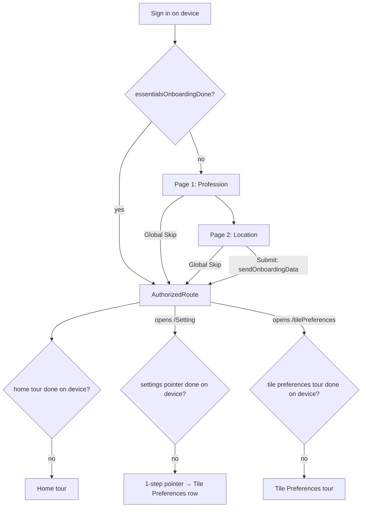

# Product Tour & Slim Onboarding Redesign

Replaces the blocking 10-page onboarding questionnaire with a 2-page
"essentials" flow plus contextual product tours. Users reach the schedule
minutes earlier; learning happens in context.

Development follows TDD: write failing test -> implement -> pass ->
analyze -> refactor. Update the tracker after every red-green-refactor cycle.

Last updated: 2026-09-12

**Resume point (pause/error recovery):** Phases 1–3 complete (commits
`711af31` phase 1, `a10302e` phase 2, `aec0f74` stage 2.4, `70d643c` phase 3).
2026-09-12 review retargeted the in-app product tour from the Settings list
to the **Tile Preferences** page (section 3.4). Next stage: **2.5 — Retarget
tour to Tile Preferences** (write `test/tile_preferences_tour_test.dart` RED
first), then Phase 4 starting at 4.1.
Resume protocol: (1) read this block, (2) the section 9 tracker row for
the next stage, (3) the newest section 10 cycle entry. The tracker and
cycle log are updated in the same commit as the code, so a mid-stage
pause or error shows up as a stage still marked `Red`/`Green` with no
matching commit — re-run that stage's tests to locate the break.

---

## 1. Decisions (locked)

| Topic | Decision |
| --- | --- |
| Full 10-page onboarding | Cut to a 2-page essentials flow |
| Essentials pages & order | 1. Profession (job description) → 2. Location |
| Skip | One **global Skip** on both pages; terminal; discards unsubmitted data |
| Submit | Single atomic submit on final page only |
| Intro slider (`OnBoardingDescriptionSlider`) | Cut — home tour takes over intro duty |
| Onboarding gate | Local flag only (`essentialsOnboardingDone`); no blocking server round-trip |
| Sign-in tour | None |
| Home tour | Existing 8-step tour, unchanged content |
| Settings-list pointer | 1 step; first visit to `/Setting`; points at the Tile Preferences row (discovery only) |
| Tile Preferences tour | New; 3 steps (transport, work/personal hours, block-out hours); first visit to `/tilePreferences`. This is the tour that teaches how to update AI preferences |
| Tour frequency | **Once per Tiler device** (SharedPreferences; survives logout; replays on reinstall/new device) |
| Existing-user seeding | None — everyone gets the settings tour once per device |
| Manual replay | Settings › "How to use Tiler" resets tours per device |

## 2. Current state (references)

- Full onboarding: `lib/routes/authentication/onBoarding.dart` (10 pages),
  `lib/bloc/onBoarding/on_boarding_bloc.dart` (`numberOfPages = 9`, hardcoded
  page indices 4/5/6/7), `lib/services/api/onBoardingApi.dart`,
  `lib/services/onBoardingHelper.dart` (`skipOnboarding` prefs flag).
- Gate: `Utility.checkOnboardingStatus()` in `lib/util.dart` =
  `skipOnboarding || areRequiredFieldsValid()` (server round-trip). Called from
  `main.dart`, `signInComponent.dart` (×6), `welcomeScreen.dart`.
- Tour engine (single-tour today): `lib/components/tutorial/*`
  (`tutorialOverlay.dart` with `buildTutorialSteps` + `kTutorialStepCount`,
  `tutorialStep.dart`, `tutorialKeys.dart`, `tutorialTooltipWidget.dart`,
  `tutorialDummyData.dart`), `lib/bloc/tutorial/tutorial_bloc.dart`,
  `lib/services/tutorialPreferencesHelper.dart`
  (`hasCompletedAppTutorial`), `_TutorialWrapper` in
  `lib/routes/authentication/AuthorizedRoute.dart`.
- Settings page: `lib/routes/authenticatedUser/settings/settingsWidget.dart`
  (`_buildListTile` rows: Account Info, Tile Preferences, Notifications,
  Connections, Feedback, Logout).

## 3. Target design

### 3.1 Flow

### 3.2 Essentials onboarding

- Page 1 — Profession: existing `ProfessionWidget` (checkbox list + "Other"
  free text, 3-char validation). Feeds server personalization; the tile
  suggestions page is cut from onboarding.
- Page 2 — Location: merge of `PrimaryLocationWidget` (address search) and the
  device-location consent from `TimeAndLocationWidget` as an in-page button
  (button-driven `GetTimeAndLocationEvent` — fixes the swipe-forces-location
  bug on today's page 4). Both inputs optional.
- Bloc cleanup: page count 2; remove hardcoded index logic (==4/5/6/7);
  restriction-profile fetch/save leaves onboarding (owned by Settings);
  wake-up/energy/workday/work-profile/personal-profile/suggestions/usage
  pages removed from the flow.
- Submit path: `sendOnboardingData` with profession + location (+ optional
  device coords/timezone) only. Skip = `SkipOnboardingEvent` -> flag -> app.
- Data recapture: Settings › Tile Preferences (hours, locations, profiles).

### 3.3 Multi-tour engine

- `TourDefinition { tourId, stepsBuilder(context), triggerPolicy }` in a
  small registry. Existing `buildTutorialSteps` becomes the `home` builder.
- `TutorialBloc` parameterized by `tourId`; completion/skip persists
  `hasCompletedTour_<tourId>`. Migration: `hasCompletedAppTutorial == true`
  maps to `home` completed.
- `TourHost` widget extracted from `_TutorialWrapper`: per-tour completion
  check -> post-frame settle delay -> `StartTutorialEvent`.
- One-tour-at-a-time guard (in-memory coordinator). A tour blocked from
  starting is not marked complete; it retries on next surface visit.
- `TutorialOverlay` generalized to render any tour's steps; home-specific
  add-tile-sheet choreography stays scoped to the `home` tour definition.

### 3.4 Tour steps

**Settings-list pointer** (`settings` tour, 1 step) — discovery only:

| # | Anchor | Message |
| --- | --- | --- |
| 1 | Tile Preferences row | Your AI preferences live here — how you travel, your work/personal hours, and block-out time |

**Tile Preferences tour** (`tile_preferences` tour, 3 steps) — anchors are
the three section cards in `tilePreferences.dart`. The template's Save
button is not a step: it only renders once `hasChanges` is true, so it does
not exist when the tour runs.

| # | Anchor (new GlobalKeys) | Message |
| --- | --- | --- |
| 1 | Transport card | How you get around — Tiler budgets travel time between tiles from this |
| 2 | Work / Personal hours card | When Tiler may schedule work vs. personal tiles; tap either to set a profile |
| 3 | Block-out hours card | Bed time and sleep — hours Tiler never schedules into |

Engine requirements surfaced by this page (both generic, in `TourHost`):

- **Anchor readiness gate.** The page shows `PendingWidget` until
  `PreferencesLoaded`; a timer-based start would spotlight nothing. After
  the settle delay `TourHost` starts only once step 1's `targetKey` is
  mounted (bounded polling); on timeout it gives up *without* marking the
  tour complete, so it retries on the next visit (same semantics as a
  coordinator block).
- **Scroll-into-view.** The page content is a non-scrolling `Column`; on
  small viewports the block-out card can sit below the fold. Content gets a
  scroll view and the overlay calls `Scrollable.ensureVisible` on the
  current step's anchor before measuring the spotlight.

History: 2.1–2.3 originally shipped a 4-step Settings-list tour (Account
Info / Tile Preferences / Notifications / Connections). Reviewed 2026-09-12
and cut to the 1-step pointer above: the list rows are self-explanatory,
and the learning users actually need is on the Tile Preferences page.

### 3.5 Gate simplification

- `checkOnboardingStatus()` becomes a local prefs read (legacy
  `skipOnboarding` OR new `essentialsOnboardingDone`); drop the
  `areRequiredFieldsValid()` server call from the critical path.
- Optional non-blocking background reconcile with the server onboarding
  record for reinstall cases (nice-to-have; Phase 4).
- Backend must tolerate absent onboarding content (already returns 404 →
  defaults; verify scheduling defaults acceptable).

## 4. Phases

### Phase 1 — Multi-tour engine foundation
1. `TourPreferencesHelper`: per-tour keys + legacy migration.
2. `TutorialBloc` gains `tourId`; completion/skip writes per-tour key.
3. `TourHost` extracted; `home` tour re-wired through it (behavior parity).
4. Tour coordinator: one active tour at a time.

### Phase 2 — Settings tour (superseded — see 2.5)
1. GlobalKeys on settings list tiles.
2. `settings` `TourDefinition` (4 steps) + l10n strings (en + es).
3. `TourHost` wired into the Settings scaffold.
4. "How to use Tiler" reset extended to per-tour / replay-all.
5. **Retarget (2026-09-12):** `settings` tour cut to a 1-step pointer at the
   Tile Preferences row; new `tile_preferences` tour (3 steps) hosted on the
   `/tilePreferences` route; `TourHost` anchor-readiness gate +
   scroll-into-view; registry `[home, settings, tile_preferences]`.

### Phase 3 — Slim essentials onboarding
1. Reduce `pages` to [Profession, Location]; profession validation keyed to
   "is profession page", not index 7.
2. Location page: merge address search + consent button; remove auto
   `GetTimeAndLocationEvent(true)` on swipe.
3. Submit → `AuthorizedRoute` directly (intro slider cut); Skip unchanged
   semantics, sets flag.
4. Remove restriction-profile calls from onboarding fetch/submit.

### Phase 4 — Gate simplification & decommission
1. `checkOnboardingStatus()` local-only; update all 8 call sites; shorten or
   remove the 3s `WelcomeScreen` delay.
2. Set `essentialsOnboardingDone` on submit and on skip.
3. Keep `OnboardingView` full flow reachable behind a debug flag (kill
   switch, `constants.dart`); delete unused sub-widgets in a later cleanup pass.
4. Optional background server reconcile.

### Phase 5 — Instrumentation, QA & rollout
1. Analytics signals (section 6) + error logging (section 7).
2. Manual QA checklist (section 8) on Android + iOS.
3. Staged rollout; monitor funnel + error dashboards; cleanup dead code.

## 5. Tests (TDD)

One test file per stage; write the failing test first. Follow existing
patterns (`test/ai_consent_gate_test.dart` for injectable seams,
`welcomeScreen.dart` builder overrides for navigation tests).

| Phase | Test file | Covers |
| --- | --- | --- |
| 1 | `test/tour_preferences_helper_test.dart` | Per-tour keys independent; legacy `hasCompletedAppTutorial` migrates to `home`; reset per tour |
| 1 | `test/tutorial_bloc_multi_tour_test.dart` | Bloc writes `hasCompletedTour_<id>` on complete/skip; step navigation unchanged |
| 1 | `test/tour_host_test.dart` | Starts tour when key unset; no start when set; no start when another tour active; retries next visit |
| 1 | `test/tour_coordinator_test.dart` | Single active tour; release on complete/skip |
| 2 | `test/settings_tour_test.dart` | 1-step pointer anchors to the live Tile Preferences row (key-sync test, mirroring `kTutorialStepCount` sync tests); triggers once per device; reset replays |
| 2 | `test/tile_preferences_tour_test.dart` | 3 steps anchor to the live section cards; no start while `PendingWidget` shows; starts once `PreferencesLoaded`; readiness timeout does not mark complete; small-viewport step is scrolled into view; once per device; reset replays all three tours |
| 3 | `test/essentials_onboarding_flow_test.dart` | Page order profession→location; profession 3-char rule on page 1; swipe does not fire location consent; consent only via button |
| 3 | `test/essentials_onboarding_skip_test.dart` | Global Skip on both pages; skip sets flag; unsubmitted data discarded (no API call) |
| 3 | `test/essentials_onboarding_submit_test.dart` | Submit sends profession+location only; navigates to AuthorizedRoute (no intro slider); flag set |
| 4 | `test/onboarding_gate_test.dart` | Gate is local-only (no API call); legacy `skipOnboarding` honored; new flag honored; fresh device → essentials |
| 4 | `test/welcome_screen_navigation_test.dart` | Existing tests updated: delay removed/shortened, routes to essentials vs AuthorizedRoute by local flag |

Gate checks per stage before marking Done:

- [ ] Stage test file green (`flutter test test/<file>`)
- [ ] Full suite green (`flutter test`)
- [ ] `flutter analyze` clean
- [ ] No hardcoded UI strings (l10n en + es, `flutter gen-l10n` ok)

## 6. Analytics & user feedback

New `AnalysticsSignal` events (naming matches existing `SETTING_PRESSED` style):

| Event | When |
| --- | --- |
| `ESSENTIALS_ONBOARDING_STARTED` | Essentials page 1 shown |
| `ESSENTIALS_ONBOARDING_PAGE` (+page id) | Page transition |
| `ESSENTIALS_ONBOARDING_SKIPPED` (+page id) | Global Skip tapped |
| `ESSENTIALS_ONBOARDING_SUBMITTED` | Successful submit |
| `TOUR_STARTED` / `TOUR_STEP` / `TOUR_COMPLETED` / `TOUR_SKIPPED` (+tourId, +stepId) | Tour lifecycle |
| `TOUR_TARGET_MISSING` (+tourId, +stepId) | Spotlight anchor failed to resolve |

Funnel metrics to watch post-launch:

- Time from sign-in to first `AuthorizedRoute` render (expect large drop).
- Essentials completion vs skip rate; per-page drop-off.
- Settings tour completion rate; Tile Preferences visits within 7 days
  (proxy for successful data recapture).
- Home tour completion rate (should hold steady or improve).

User-validated feedback log (newest first):

| Date | Source | Area | Feedback | Validated? | Action |
| --- | --- | --- | --- | --- | --- |
| | | | | | |

## 7. Logging & error detection

- Replace `print` in onboarding paths with `Utility.debugPrint`; never log
  auth headers or response bodies (existing `onBoardingApi.dart` prints
  headers/bodies — remove while touching these files).
- Tour engine defensive logging:
  - Anchor resolution failure (`TOUR_TARGET_MISSING` signal + debug log),
    step auto-skips to next rather than rendering a broken spotlight.
  - Tour start blocked by coordinator (debug log with holder tourId).
  - Prefs read/write failures fall back to "not completed" (tour may replay;
    never crash).
- Essentials flow:
  - `sendOnboardingData` failure → existing toast + stay on flow; log signal
    `ESSENTIALS_ONBOARDING_SUBMIT_FAILED`; Skip remains available (user is
    never trapped).
  - Location permission `deniedForever` → do not block; continue without
    coords (no forced settings redirect).
- Fix log (defects found during rollout, newest first):

| Date | Area | Symptom | Root cause | Fix | Test added |
| --- | --- | --- | --- | --- | --- |
| | | | | | |

## 8. Manual QA checklist

- [ ] Fresh install: sign in → profession page appears first
- [ ] Global Skip on page 1 and page 2 both land on schedule; flow never
      re-triggers on relaunch
- [ ] Fill profession, skip on location page → no API submit; nothing saved
- [ ] Full submit → schedule directly (no intro slider); data visible
      server-side
- [ ] Swiping pages never triggers a location permission prompt; only the
      in-page button does
- [ ] Home tour auto-starts once on fresh device; not after completion
- [ ] First visit to Settings starts settings tour; anchors align with tiles
      in light + dark themes, small + large screens
- [ ] Settings tour never re-shows after complete/skip; survives logout;
      replays after reinstall
- [ ] "How to use Tiler" replays tours
- [ ] Legacy user (old `hasCompletedAppTutorial` / `skipOnboarding` flags):
      no home tour replay, no essentials flow, settings tour shows once
- [ ] en + es strings render; no overflow on smallest supported device
- [ ] Offline sign-in: gate resolves locally, no hang

## 9. Implementation tracker

Status legend: `Not started` | `Red (test failing)` | `Green (test passing)` | `Refactored` | `Done`

| # | Stage | Test file | Impl file(s) | Status | Notes |
| --- | --- | --- | --- | --- | --- |
| 1.1 | Tour prefs helper + migration | `test/tour_preferences_helper_test.dart` | `lib/services/tutorialPreferencesHelper.dart` | Done | 12 tests green; reset writes `false` (never removes) so legacy migration can't re-apply; legacy `TutorialPreferencesHelper` kept as delegating shim for the 1.2/1.3 transition |
| 1.2 | Multi-tour TutorialBloc | `test/tutorial_bloc_multi_tour_test.dart` | `lib/bloc/tutorial/tutorial_bloc.dart` | Done | `tourId` parameter added (defaults to `home` so existing `AuthorizedRoute` wiring keeps working during the transition); complete/skip persist `hasCompletedTour_<tourId>`, reset writes `false` for that key only — the legacy `hasCompletedAppTutorial` flag is never written by the multi-tour path; step navigation unchanged. 8 tests green |
| 1.3 | TourHost extraction + home parity | `test/tour_host_test.dart` | `lib/components/tutorial/tourHost.dart`, `tutorialOverlay.dart`, `AuthorizedRoute.dart` | Done | `TourHost` extracted (owns per-tour `TutorialBloc`, per-tour completion check, settle delay, coordinator gate, release on complete/skip); `AuthorizedRoute`'s `_TutorialWrapper` + root `TutorialBloc` provider removed and home tour now hosted via `TourHost`; `TutorialOverlay` generalized with `tourId`, dummy-tile injection scoped to the home tour. 7 tests green (start decisions, blocked-tour retry, skip→release, legacy home parity). Skip test initially hung to the 10-min timeout — a bare `Future.delayed` never completes under `testWidgets`' fake-async clock; flush with `tester.pump()` instead. Also fixed an import regression: `kTutorialStepCount` is defined in `tutorialOverlay.dart`, which `AuthorizedRoute` still needs for the legacy sheet dialogs |
| 1.4 | Tour coordinator | (folded into `test/tour_host_test.dart`) | `lib/components/tutorial/tourCoordinator.dart` | Done | Implemented early alongside 1.3: in-memory singleton, one active tour at a time across surfaces, re-entry replay for the same tour, owner-only release. Deliberately non-persistent — persistence stays in `TourPreferencesHelper`. Blocked tours are never marked complete and retry on the next surface visit. Block/skip/release behavior is pinned by the tour host tests; a separate unit file was folded in to avoid duplication |
| 2.1 | Settings anchors + tour definition | `test/settings_tour_test.dart` | `lib/components/tutorial/tours/settingsTour.dart`, `settingsWidget.dart` | Done | 4-step contract locked (ids `account_info` → `tile_preferences` → `notifications` → `connections`); `SettingsTourKeys` anchors attached to the 4 live `Settings` rows exactly once (`_buildListTile` gained an optional `Key`); once-per-device lifecycle pinned (first-visit start, spotlight == live row rect, real overlay taps advance, completion persists `hasCompletedTour_settings`, no restart on revisit, reset replays); `TourHost.stepsBuilder` added with home-tour default so home parity is unchanged |
| 2.2 | Settings tour l10n | (compiled via 2.1 test) | `lib/l10n/app_en.arb`, `app_es.arb` | Done | 4 EN + 4 ES strings; titles echo the row labels, bodies per section 3.4; generated `app_localizations*.dart` compiled via `flutter gen-l10n` and checked in |
| 2.3 | TourHost wired into the `/Setting` route | (extend 2.1: production-route group) | `lib/main.dart` | Done | `/Setting` is now built by top-level `buildSettingsRoute` (single source of truth for the routes map and tests): `TourHost(tourId: settingsTourId, stepCount: kSettingsTourStepCount, stepsBuilder: buildSettingsTourSteps, child: Settings())` with the default 1200ms settle delay. 2 tests green: static contract on the route builder + first visit to the real route starts the tour on row 1. Red: `buildSettingsRoute` undefined |
| 2.5 | Retarget tour to Tile Preferences | `test/tile_preferences_tour_test.dart` (+ `settings_tour_test.dart` trimmed) | `tours/tilePreferencesTour.dart`, `tours/settingsTour.dart`, `tourHost.dart`, `tutorialOverlay.dart`, `tilePreferences.dart`, `main.dart`, l10n | Not started | Supersedes the 4-step list tour from 2.1–2.3. Save button is not a step (renders only on `hasChanges`) |
| 2.4 | Per-tour "How to use Tiler" reset row in Settings | (extend 2.1) | `settingsWidget.dart`, `tutorialPreferencesHelper.dart`, `HowToUseTiler.svg` | Done | Replay-all per section 1 "Manual replay": tap clears every registered tour (new `TourPreferencesHelper.allTourIds` + `resetTours`, default `[home, settings]`); writes `false` per key, never the legacy flag (1.2 design); each tour replays on its next surface visit. Settings row between Feedback and Logout, new `HowToUseTiler.svg` + `howToUseTiler` l10n (en + es); sends `SETTINGS_REPLAY_TOURS`. 8 tests: 5 unit (registry contents, full + partial reset, no legacy write, reset-false beats legacy migration) + 3 widget (row visible, tap resets both flags in place, next-visit replay from step 1). settings_tour 15/15, tour_preferences_helper 16/16, full suite 460 pass / 5 pre-existing fails (unchanged), analyze 542 (baseline) |
| 3.1 | Essentials pages + order + validation | `test/essentials_onboarding_flow_test.dart` | `onBoarding.dart`, `on_boarding_bloc.dart` | Done | 6 tests: 2 pages, Profession→Location order, 3-char custom-profession gate (state-driven via `professionPageIndex`, not a page number), swipe/Next never touch the geolocator, consent only via the in-page button (no navigation), decline is a no-op. `OnboardingView` gained an optional `bloc` DI seam so tests seed state without network fetches |
| 3.2 | Merged location page | (extend 3.1) | `primaryLocationWidget.dart` | Done | Landed together with 3.1: address search + consent sub-text + in-page `useDeviceLocation` button wired to `GetTimeAndLocationEvent(true)`; consent behavior pinned by 3.1's tests |
| 3.3 | Global skip semantics | `test/essentials_onboarding_skip_test.dart` | `on_boarding_bloc.dart`, `onBoarding.dart` | Done | 7 tests: Skip visible on both pages; tapping Skip pushes the exit destination (production `AuthorizedRoute`) and the onboarding tree is removed after the transition; skip persists `skipOnboarding=true` with zero onboarding API calls (no fetch, no send); the terminal skipped state (`pageNumber == null`) is safe - post-Skip `NextPageEvent`/`PreviousPageEvent` are guarded no-ops (new early-return guards in `_onNextPageChanged`/`_onPreviousPageEvent` when `pageNumber == null` or `step == skipped`); skip from page 2; normal swipe/Next never skips. `OnboardingView` gained an optional `skipDestinationBuilder` seam so tests verify the exit route without rendering `AuthorizedRoute` (its `initState` needs ancestor providers/platform channels) |
| 3.4 | Atomic submit → AuthorizedRoute | `test/essentials_onboarding_submit_test.dart` | `on_boarding_bloc.dart`, `onBoarding.dart`, `onBoardingHelper.dart`, `data/onBoarding.dart` | Done | 7 tests: submit is page-2 only (page-1 Next never sends); the payload is essentials-only (`profession` + primary location + optional device coords/timezone; the legacy hours/day-sections/tasks/tiles/usage fields are no longer collected and are not sent -- `OnboardingContent` gained a `Profession` JSON field); restriction-profile save removed from the submit handler (Settings owns it, design 3.2); success persists the local `essentialsOnboardingDone` flag (new key + getter/setter in `OnBoardingSharedPreferencesHelper`; `skipOnboarding` untouched), buzzes the schedule exactly once, and pushReplaces to `AuthorizedRoute` directly (intro slider cut; unused `OnBoardingDescriptionSlider` import removed); failure keeps the flow on the location page with the existing error toast (`TilerError.Message` now surfaced instead of `Instance of 'TilerError'`), Skip left available, no navigation/buzz/flag, no retry. `OnboardingView` gained optional `submitDestinationBuilder` + `scheduleApi` seams (tests inject a `FakeScheduleApi` so the buzz call is recorded, not performed). Dead code removed: `_requestFormatTime` + two unused locals |
| 4.1 | Local-only gate + call sites | `test/onboarding_gate_test.dart` | `util.dart`, `signInComponent.dart`, `main.dart` | Not started | |
| 4.2 | WelcomeScreen delay + routing | `test/welcome_screen_navigation_test.dart` | `welcomeScreen.dart` | Not started | existing 2 tests must be updated (both `pump(3s)`); the 6 `signInComponent` call sites discard the gate result and re-run it via `WelcomeScreen` — delete them in 4.1 |
| 4.3 | Kill-switch flag for legacy flow | (manual) | `constants.dart` | Not started | `executionConstants.dart` holds one unrelated constant; `constants.dart` already owns `isDebug` |
| 5.1 | Analytics signals | (unit-light; verify names) | tour engine + onboarding files | Not started | |
| 5.2 | Logging hardening (remove header/body prints) | (analyze pass) | `onBoardingApi.dart` | Not started | security: stop logging auth headers |
| 5.3 | Manual QA (section 8) | — | — | Not started | Android + iOS |

## 10. TDD cycle log

Record each meaningful cycle. Newest first.

| Date | Stage | Cycle | Result | Notes |
| --- | --- | --- | --- | --- |
| 2026-09-12 | 0 (review) | — | Doc sync | Review against the repo before Phase 4. Corrections: resume block still pointed at 3.1 although Phase 3 landed in `70d643c`; 4.2's test file is `welcome_screen_navigation_test.dart` (no `_routing_` file exists); 4.3's flag belongs in `constants.dart`. Product correction: the 4-step Settings-list tour teaches the wrong surface — the learning users need (how to update AI preferences) lives on Tile Preferences. Redesigned as a 1-step list pointer + 3-step Tile Preferences tour (section 3.4), tracked as stage 2.5. Repo hygiene: `70d643c` had committed `android/build/.last_build_id` and `android/build/reports/problems/problems-report.html` (Gradle output) — untracked and `android/build/` added to `.gitignore`. |
| 2026-08-27 | 3.4 | 1 | Green | Atomic submit -> AuthorizedRoute. Red: `test/essentials_onboarding_submit_test.dart` (7 tests) failed to compile -- the stage-3.4 contract was missing (`OnboardingView.submitDestinationBuilder` / `scheduleApi` seams, `OnBoardingSharedPreferencesHelper.getEssentialsOnboardingDone`, `OnboardingContent.profession`); the one assertion that did run (no intro slider) failed against the legacy `OnBoardingDescriptionSlider` navigation. Green: submit payload is essentials-only (`profession` + primary location + optional device coords/timezone; the legacy hours/day-sections/tasks/tiles/usage fields are no longer collected and are sent as null), restriction-profile save removed from `_onOnboardingRequestedEvent` (Settings owns it, design 3.2), success path persists the local `essentialsOnboardingDone` flag (new key in `OnBoardingSharedPreferencesHelper`) and buzzes the schedule exactly once before pushReplacing to `AuthorizedRoute` directly (intro slider cut; unused `OnBoardingDescriptionSlider` import removed from the route). Failure path stays in the flow: existing error toast, location page intact, Skip available, no navigation/buzz/flag, no retry. One real bug surfaced and fixed: the catch emitted `e.toString()`, so `TilerError`s toasted as "Instance of 'TilerError'" -- the handler now surfaces `TilerError.Message`. `OnboardingView` gained optional `submitDestinationBuilder` + `scheduleApi` seams (tests inject a `FakeScheduleApi` so the buzz call is recorded, not performed); dead code removed (`_requestFormatTime`, two unused locals). Test mechanics: the 700ms debounce is flushed with bounded pumps (`pump(800ms)`), never `pumpAndSettle` while the 2.5s toast timer is live; `group` (not a nested `testWidgets`) as the container. Final: 7/7 green; full suite 480 pass / 5 pre-existing fails (same 5 as the 3.3 baseline: enhanced_tile_batch x2, home_layout chat icon, preview_sentence load, widget_test smoke); `flutter analyze` 539 (2 below the 541 baseline -- dead code removed; zero new issues on touched files). |
| 2026-08-26 | 3.3 | 1 | Green | Global skip semantics + safe terminal skipped state. Red: post-Skip `NextPageEvent`/`PreviousPageEvent` crashed on `state.pageNumber!` (the skipped state carries `pageNumber == null`); the exit navigation was also untestable because the route builds `AuthorizedRoute`, whose `initState` needs ancestor providers/platform channels unavailable in tests. Green: 7 tests in `essentials_onboarding_skip_test.dart` - Skip visible on both pages; Skip pushes the exit destination (verified through a new optional `skipDestinationBuilder` seam on `OnboardingView` with a marker stand-in; onboarding removed from the tree after `pumpAndSettle`); skip persists `skipOnboarding` with zero onboarding API calls (`FakeOnBoardingApi` counters at 0); post-Skip page-change events are guarded no-ops (bloc guards added to `_onNextPageChanged`/`_onPreviousPageEvent` on `pageNumber == null` or `step == skipped`); skip from page 2; normal swipe/Next never skips. Harness notes: `tester.tap` already pumps a frame, so the destination route's first build lands one frame after the push - assert after `pumpAndSettle`; `SharedPreferences.setMockInitialValues` for the persisted preference; geolocator + onboarding API faked. Full suite 473 pass / 5 pre-existing fails (unchanged vs baseline); analyze 541 (baseline). |
| 2026-08-26 | 3.1 + 3.2 | 1 | Green | Two-page essentials flow (Phases 3.1 + 3.2 — the merged location page landed with 3.1; its behavior is pinned by 3.1's tests). Red: `test/essentials_onboarding_flow_test.dart` (6 tests) failed against the legacy 10-page flow — page count 10 ≠ 2, page 0 not profession, no in-page location button. Green: (a) `onBoarding.dart` — `pages = [ProfessionWidget(), PrimaryLocationWidget()]` (profession first, location second), 8 now-unused widget imports removed, optional `OnboardingBloc? bloc` DI seam added (tests seed the bloc without network fetches). (b) `on_boarding_bloc.dart` — `numberOfPages = 2` + named `professionPageIndex = 0`; removed the `pageNumber == 4` auto-`GetTimeAndLocationEvent(true)` swipe trigger and the `_setWorkOrPersonalLoadedStep` `==5/6` index gating; `_canProceedToNextPage` is state-driven (on the profession page: custom professions need a non-'Other' profession with `trim().length >= 3`); `_onGetTimeAndLocationEvent` is consent-only — it no longer advances the page (location is the last page), declines return early, and a denied permission no longer attempts `getCurrentPosition` (optional input). (c) `primaryLocationWidget.dart` — in-page `useDeviceLocation` button (l10n en + es) driving `GetTimeAndLocationEvent(true)`, plus the `timeAndLocationSecondarySubTitle` consent sub-text. Notes: removed deprecated `synthetic-package: false` from `l10n.yaml` — `flutter gen-l10n` on Flutter 3.47.1 aborts on that option. Test mechanics: `tester.drag` produces no `primaryVelocity`, so the swipe test uses `tester.fling`; the 2.5s toast timer is flushed with bounded pumps (never `pumpAndSettle` against the overlay). Final: 6/6 green; full suite 466 pass / 5 pre-existing fails (same 5: enhanced_tile_batch ×2, home_layout chat icon, preview_sentence load, widget_test smoke); `flutter analyze` 541 — one below the 542 baseline (dead code removed), zero new issues on touched files. |
| 2026-08-26 | 2.4 | 1 | Green | "How to use Tiler" manual replay row (Phase 2 item 4; closes Phase 2). Decision: **replay-all** per section 1 "Manual replay" — one Settings row clears every registered tour; each tour replays on its next surface visit (no in-place restart, no dialog). Impl: new `TourPreferencesHelper.allTourIds` registry + `resetTours([tourIds = allTourIds])` (writes `false` per tour key; never the legacy `hasCompletedAppTutorial`, per the 1.2 design); new `HowToUseTiler.svg` (help-outline, 24x24, matches sibling icons); Settings row between Feedback and Logout with `howToUseTiler` l10n (en "How to use Tiler" / es "Cómo usar Tiler"; `flutter gen-l10n` ok — the es arb stays partial by design and untranslated keys fall back to the en template); the tap sends `SETTINGS_REPLAY_TOURS` (matches the `SETTINGS_LOG_OUT_USER` style). Red: `howToUseTiler`/`allTourIds`/`resetTours` undefined (compile fail in both test files). Green: 8 new tests — 5 unit in `tour_preferences_helper_test` (registry covers home + settings, default reset clears all, partial list resets only the listed tours, legacy flag never written, reset-`false` blocks the legacy re-migration) + 3 widget in `settings_tour_test` (row renders on the live surface, tapping resets both flags in place without navigating, next settings visit replays from step 1 while the home tour is primed to replay). Final: `settings_tour_test` 15/15, `tour_preferences_helper_test` 16/16, full suite 460 pass / 5 pre-existing fails (same 5 as the 2.1–2.3 baseline: enhanced_tile_batch ×2, home_layout chat icon, preview_sentence load, widget_test smoke); `flutter analyze` 542 (baseline; no new issues). No refactor changes needed. |
| 2026-08-26 | 2.1–2.3 | 1 | Green | Settings tour end-to-end. 2.1: `SettingsTourKeys` anchors on the 4 real `Settings` rows, `buildSettingsTourSteps`/`kSettingsTourStepCount` in `tours/settingsTour.dart`, `TourHost.stepsBuilder` (defaults to the home tour — backward compatible), `TourPreferencesHelper.settingsTourId`; 10 tests green. Two real bugs surfaced and fixed: (a) tooltip footer overflow — the last step's primary button pushed the nav Row 10px past the 336px width (would also occur on ~360dp phones); fixed in `tutorialTooltipWidget.dart` (button padding 24→16, Back/Next gap 8→4). (b) Pre-existing icon drift — `HomeFab` had already switched to `Icons.auto_awesome` in an earlier commit while the chat step still advertised `chat_outlined`; verified the sync-test failure at baseline `711af31` in a throwaway worktree, then aligned the step icon and the test. 2.2: 4 EN + 4 ES l10n strings, compiled via `flutter gen-l10n`. 2.3: production wiring — `/Setting` in `main.dart` now uses top-level `buildSettingsRoute` (single source of truth for the routes map and tests); RED = `buildSettingsRoute` undefined; GREEN = 2 new tests (static contract on the route builder; first visit to the real route starts the tour spotlighting the live Account Info row). Final: `settings_tour_test` 12/12, full tour suite 52/52, full suite 452 pass / 5 pre-existing fails (unchanged vs baseline), `flutter analyze` clean on touched files (one pre-existing unused-import warning in `main.dart`, untouched). |
| 2026-08-26 | 1.3 | 1 | Green | Implemented `TourCoordinator` (in-memory singleton; one active tour at a time; re-entry replay; owner-only release) and `TourHost` (owns the per-tour `TutorialBloc`, applies the per-tour completion check via `TourPreferencesHelper`, waits a settle delay, starts only when the coordinator allows, releases on complete/skip). Generalized `TutorialOverlay` with `tourId` + `stepsBuilder`, scoped dummy-tile injection to the home tour, and rewired `AuthorizedRoute` to host the home tour via `TourHost` (removed `_TutorialWrapper` + the root `TutorialBloc` provider). Red: `TourHost` undefined. Green: 7 tests in `tour_host_test.dart`. Bug found + fixed during the cycle: the skip test hung to the 10-minute timeout — a bare `Future.delayed` never completes under `testWidgets`' fake-async clock; replaced with `tester.pump()` to flush the skip state. Also fixed an import regression (accidentally dropped `tutorialOverlay.dart`, which defines `kTutorialStepCount` used by the legacy sheet dialogs). Final verification: full suite 439 pass / 6 pre-existing fails (same 6: home_layout chat icon, onboarding_tour_sync chat_fab icon, enhanced_tile_batch ×2, preview_sentence load, widget_test smoke); `flutter analyze` 542 (baseline; no new issues). |
| 2026-08-26 | 1.2 | 1 | Green | `TutorialBloc` is now parameterized by `tourId` (defaults to `home` so the existing `AuthorizedRoute` wiring keeps working during the 1.2/1.3 transition). `_onSkip`/`_onComplete` persist `hasCompletedTour_<tourId>` and `_onReset` writes `false` for that key only — the legacy `hasCompletedAppTutorial` flag is never written by the multi-tour path. 8 tests green in `tutorial_bloc_multi_tour_test.dart` (per-tour persistence isolation, reset never pollutes the legacy key, step navigation start/next/previous/reset unchanged). Full suite: no new failures (same 6 pre-existing). |
| 2026-08-26 | 1.1 | 1 | Green | Baseline first: upgraded local Flutter 3.38.5 → 3.47.1 (lockfile needs Dart ≥3.12). Baseline: 412 pass / 6 pre-existing fails; analyze 542 (1E/294W/247I). Red: `TourPreferencesHelper` undefined. Green: 12 tests — per-tour key independence, `hasCompletedTour_<tourId>` key format, legacy `hasCompletedAppTutorial` → `home` one-time persisted migration, reset beats legacy, per-tour reset isolation. Full suite 424 pass / same 6 pre-existing fails; analyze 542 (no new issues). No refactor changes needed. |
