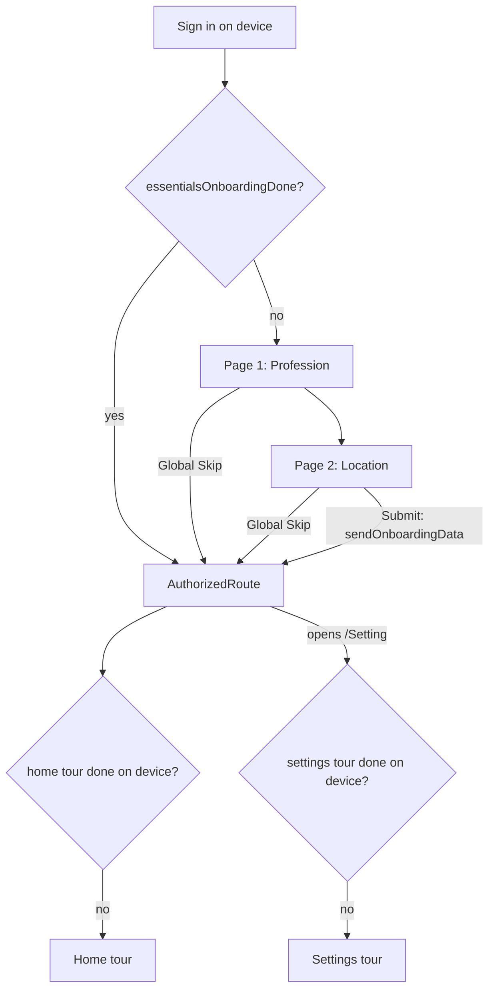

# Product Tour & Slim Onboarding Redesign

Replaces the blocking 10-page onboarding questionnaire with a 2-page
"essentials" flow plus contextual product tours. Users reach the schedule
minutes earlier; learning happens in context.

Development follows TDD: write failing test -> implement -> pass ->
analyze -> refactor. Update the tracker after every red-green-refactor cycle.

Last updated: 2026-08-26

---

## 1. Decisions (locked)

| Topic | Decision |
| --- | --- |
| Full 10-page onboarding | Cut to a 2-page essentials flow |
| Essentials pages & order | 1. Profession (job description) → 2. Location |
| Skip | One **global Skip** on both pages; terminal; discards unsubmitted data |
| Submit | Single atomic submit on final page only |
| Intro slider (`OnBoardingDescriptionSlider`) | Cut — home tour takes over intro duty |
| Onboarding gate | Local flag only (`essentialsOnboardingDone`); no blocking server round-trip |
| Sign-in tour | None |
| Home tour | Existing 8-step tour, unchanged content |
| Settings tour | New; 4 steps; first visit to `/Setting` |
| Tour frequency | **Once per Tiler device** (SharedPreferences; survives logout; replays on reinstall/new device) |
| Existing-user seeding | None — everyone gets the settings tour once per device |
| Manual replay | Settings › "How to use Tiler" resets tours per device |

## 2. Current state (references)

- Full onboarding: `lib/routes/authentication/onBoarding.dart` (10 pages),
  `lib/bloc/onBoarding/on_boarding_bloc.dart` (`numberOfPages = 9`, hardcoded
  page indices 4/5/6/7), `lib/services/api/onBoardingApi.dart`,
  `lib/services/onBoardingHelper.dart` (`skipOnboarding` prefs flag).
- Gate: `Utility.checkOnboardingStatus()` in `lib/util.dart` =
  `skipOnboarding || areRequiredFieldsValid()` (server round-trip). Called from
  `main.dart`, `signInComponent.dart` (×6), `welcomeScreen.dart`.
- Tour engine (single-tour today): `lib/components/tutorial/*`
  (`tutorialOverlay.dart` with `buildTutorialSteps` + `kTutorialStepCount`,
  `tutorialStep.dart`, `tutorialKeys.dart`, `tutorialTooltipWidget.dart`,
  `tutorialDummyData.dart`), `lib/bloc/tutorial/tutorial_bloc.dart`,
  `lib/services/tutorialPreferencesHelper.dart`
  (`hasCompletedAppTutorial`), `_TutorialWrapper` in
  `lib/routes/authentication/AuthorizedRoute.dart`.
- Settings page: `lib/routes/authenticatedUser/settings/settingsWidget.dart`
  (`_buildListTile` rows: Account Info, Tile Preferences, Notifications,
  Connections, Feedback, Logout).

## 3. Target design

### 3.1 Flow

### 3.2 Essentials onboarding

- Page 1 — Profession: existing `ProfessionWidget` (checkbox list + "Other"
  free text, 3-char validation). Feeds server personalization; the tile
  suggestions page is cut from onboarding.
- Page 2 — Location: merge of `PrimaryLocationWidget` (address search) and the
  device-location consent from `TimeAndLocationWidget` as an in-page button
  (button-driven `GetTimeAndLocationEvent` — fixes the swipe-forces-location
  bug on today's page 4). Both inputs optional.
- Bloc cleanup: page count 2; remove hardcoded index logic (==4/5/6/7);
  restriction-profile fetch/save leaves onboarding (owned by Settings);
  wake-up/energy/workday/work-profile/personal-profile/suggestions/usage
  pages removed from the flow.
- Submit path: `sendOnboardingData` with profession + location (+ optional
  device coords/timezone) only. Skip = `SkipOnboardingEvent` -> flag -> app.
- Data recapture: Settings › Tile Preferences (hours, locations, profiles).

### 3.3 Multi-tour engine

- `TourDefinition { tourId, stepsBuilder(context), triggerPolicy }` in a
  small registry. Existing `buildTutorialSteps` becomes the `home` builder.
- `TutorialBloc` parameterized by `tourId`; completion/skip persists
  `hasCompletedTour_<tourId>`. Migration: `hasCompletedAppTutorial == true`
  maps to `home` completed.
- `TourHost` widget extracted from `_TutorialWrapper`: per-tour completion
  check -> post-frame settle delay -> `StartTutorialEvent`.
- One-tour-at-a-time guard (in-memory coordinator). A tour blocked from
  starting is not marked complete; it retries on next surface visit.
- `TutorialOverlay` generalized to render any tour's steps; home-specific
  add-tile-sheet choreography stays scoped to the `home` tour definition.

### 3.4 Settings tour steps

| # | Anchor (new GlobalKeys) | Message |
| --- | --- | --- |
| 1 | Account Info tile | Profile and account details |
| 2 | Tile Preferences tile | Hours, locations, profiles — "fine-tune what onboarding used to ask" |
| 3 | Notifications tile | How Tiler nudges you |
| 4 | Connections tile | Connect Google Calendar |

### 3.5 Gate simplification

- `checkOnboardingStatus()` becomes a local prefs read (legacy
  `skipOnboarding` OR new `essentialsOnboardingDone`); drop the
  `areRequiredFieldsValid()` server call from the critical path.
- Optional non-blocking background reconcile with the server onboarding
  record for reinstall cases (nice-to-have; Phase 4).
- Backend must tolerate absent onboarding content (already returns 404 →
  defaults; verify scheduling defaults acceptable).

## 4. Phases

### Phase 1 — Multi-tour engine foundation
1. `TourPreferencesHelper`: per-tour keys + legacy migration.
2. `TutorialBloc` gains `tourId`; completion/skip writes per-tour key.
3. `TourHost` extracted; `home` tour re-wired through it (behavior parity).
4. Tour coordinator: one active tour at a time.

### Phase 2 — Settings tour
1. GlobalKeys on settings list tiles.
2. `settings` `TourDefinition` (4 steps) + l10n strings (en + es).
3. `TourHost` wired into the Settings scaffold.
4. "How to use Tiler" reset extended to per-tour / replay-all.

### Phase 3 — Slim essentials onboarding
1. Reduce `pages` to [Profession, Location]; profession validation keyed to
   "is profession page", not index 7.
2. Location page: merge address search + consent button; remove auto
   `GetTimeAndLocationEvent(true)` on swipe.
3. Submit → `AuthorizedRoute` directly (intro slider cut); Skip unchanged
   semantics, sets flag.
4. Remove restriction-profile calls from onboarding fetch/submit.

### Phase 4 — Gate simplification & decommission
1. `checkOnboardingStatus()` local-only; update all 8 call sites; shorten or
   remove the 3s `WelcomeScreen` delay.
2. Set `essentialsOnboardingDone` on submit and on skip.
3. Keep `OnboardingView` full flow reachable behind a debug flag (kill
   switch); delete unused sub-widgets in a later cleanup pass.
4. Optional background server reconcile.

### Phase 5 — Instrumentation, QA & rollout
1. Analytics signals (section 6) + error logging (section 7).
2. Manual QA checklist (section 8) on Android + iOS.
3. Staged rollout; monitor funnel + error dashboards; cleanup dead code.

## 5. Tests (TDD)

One test file per stage; write the failing test first. Follow existing
patterns (`test/ai_consent_gate_test.dart` for injectable seams,
`welcomeScreen.dart` builder overrides for navigation tests).

| Phase | Test file | Covers |
| --- | --- | --- |
| 1 | `test/tour_preferences_helper_test.dart` | Per-tour keys independent; legacy `hasCompletedAppTutorial` migrates to `home`; reset per tour |
| 1 | `test/tutorial_bloc_multi_tour_test.dart` | Bloc writes `hasCompletedTour_<id>` on complete/skip; step navigation unchanged |
| 1 | `test/tour_host_test.dart` | Starts tour when key unset; no start when set; no start when another tour active; retries next visit |
| 1 | `test/tour_coordinator_test.dart` | Single active tour; release on complete/skip |
| 2 | `test/settings_tour_test.dart` | 4 steps anchor to live settings tiles (key-sync test, mirroring `kTutorialStepCount` sync tests); triggers once per device; reset replays |
| 3 | `test/essentials_onboarding_flow_test.dart` | Page order profession→location; profession 3-char rule on page 1; swipe does not fire location consent; consent only via button |
| 3 | `test/essentials_onboarding_skip_test.dart` | Global Skip on both pages; skip sets flag; unsubmitted data discarded (no API call) |
| 3 | `test/essentials_onboarding_submit_test.dart` | Submit sends profession+location only; navigates to AuthorizedRoute (no intro slider); flag set |
| 4 | `test/onboarding_gate_test.dart` | Gate is local-only (no API call); legacy `skipOnboarding` honored; new flag honored; fresh device → essentials |
| 4 | `test/welcome_screen_routing_test.dart` | Existing tests updated: delay removed/shortened, routes to essentials vs AuthorizedRoute by local flag |

Gate checks per stage before marking Done:

- [ ] Stage test file green (`flutter test test/<file>`)
- [ ] Full suite green (`flutter test`)
- [ ] `flutter analyze` clean
- [ ] No hardcoded UI strings (l10n en + es, `flutter gen-l10n` ok)

## 6. Analytics & user feedback

New `AnalysticsSignal` events (naming matches existing `SETTING_PRESSED` style):

| Event | When |
| --- | --- |
| `ESSENTIALS_ONBOARDING_STARTED` | Essentials page 1 shown |
| `ESSENTIALS_ONBOARDING_PAGE` (+page id) | Page transition |
| `ESSENTIALS_ONBOARDING_SKIPPED` (+page id) | Global Skip tapped |
| `ESSENTIALS_ONBOARDING_SUBMITTED` | Successful submit |
| `TOUR_STARTED` / `TOUR_STEP` / `TOUR_COMPLETED` / `TOUR_SKIPPED` (+tourId, +stepId) | Tour lifecycle |
| `TOUR_TARGET_MISSING` (+tourId, +stepId) | Spotlight anchor failed to resolve |

Funnel metrics to watch post-launch:

- Time from sign-in to first `AuthorizedRoute` render (expect large drop).
- Essentials completion vs skip rate; per-page drop-off.
- Settings tour completion rate; Tile Preferences visits within 7 days
  (proxy for successful data recapture).
- Home tour completion rate (should hold steady or improve).

User-validated feedback log (newest first):

| Date | Source | Area | Feedback | Validated? | Action |
| --- | --- | --- | --- | --- | --- |
| | | | | | |

## 7. Logging & error detection

- Replace `print` in onboarding paths with `Utility.debugPrint`; never log
  auth headers or response bodies (existing `onBoardingApi.dart` prints
  headers/bodies — remove while touching these files).
- Tour engine defensive logging:
  - Anchor resolution failure (`TOUR_TARGET_MISSING` signal + debug log),
    step auto-skips to next rather than rendering a broken spotlight.
  - Tour start blocked by coordinator (debug log with holder tourId).
  - Prefs read/write failures fall back to "not completed" (tour may replay;
    never crash).
- Essentials flow:
  - `sendOnboardingData` failure → existing toast + stay on flow; log signal
    `ESSENTIALS_ONBOARDING_SUBMIT_FAILED`; Skip remains available (user is
    never trapped).
  - Location permission `deniedForever` → do not block; continue without
    coords (no forced settings redirect).
- Fix log (defects found during rollout, newest first):

| Date | Area | Symptom | Root cause | Fix | Test added |
| --- | --- | --- | --- | --- | --- |
| | | | | | |

## 8. Manual QA checklist

- [ ] Fresh install: sign in → profession page appears first
- [ ] Global Skip on page 1 and page 2 both land on schedule; flow never
      re-triggers on relaunch
- [ ] Fill profession, skip on location page → no API submit; nothing saved
- [ ] Full submit → schedule directly (no intro slider); data visible
      server-side
- [ ] Swiping pages never triggers a location permission prompt; only the
      in-page button does
- [ ] Home tour auto-starts once on fresh device; not after completion
- [ ] First visit to Settings starts settings tour; anchors align with tiles
      in light + dark themes, small + large screens
- [ ] Settings tour never re-shows after complete/skip; survives logout;
      replays after reinstall
- [ ] "How to use Tiler" replays tours
- [ ] Legacy user (old `hasCompletedAppTutorial` / `skipOnboarding` flags):
      no home tour replay, no essentials flow, settings tour shows once
- [ ] en + es strings render; no overflow on smallest supported device
- [ ] Offline sign-in: gate resolves locally, no hang

## 9. Implementation tracker

Status legend: `Not started` | `Red (test failing)` | `Green (test passing)` | `Refactored` | `Done`

| # | Stage | Test file | Impl file(s) | Status | Notes |
| --- | --- | --- | --- | --- | --- |
| 1.1 | Tour prefs helper + migration | `test/tour_preferences_helper_test.dart` | `lib/services/tutorialPreferencesHelper.dart` | Done | 12 tests green; reset writes `false` (never removes) so legacy migration can't re-apply; legacy `TutorialPreferencesHelper` kept as delegating shim for the 1.2/1.3 transition |
| 1.2 | Multi-tour TutorialBloc | `test/tutorial_bloc_multi_tour_test.dart` | `lib/bloc/tutorial/tutorial_bloc.dart` | Done | `tourId` parameter added (defaults to `home` so existing `AuthorizedRoute` wiring keeps working during the transition); complete/skip persist `hasCompletedTour_<tourId>`, reset writes `false` for that key only — the legacy `hasCompletedAppTutorial` flag is never written by the multi-tour path; step navigation unchanged. 8 tests green |
| 1.3 | TourHost extraction + home parity | `test/tour_host_test.dart` | `lib/components/tutorial/tourHost.dart`, `tutorialOverlay.dart`, `AuthorizedRoute.dart` | Done | `TourHost` extracted (owns per-tour `TutorialBloc`, per-tour completion check, settle delay, coordinator gate, release on complete/skip); `AuthorizedRoute`'s `_TutorialWrapper` + root `TutorialBloc` provider removed and home tour now hosted via `TourHost`; `TutorialOverlay` generalized with `tourId`, dummy-tile injection scoped to the home tour. 7 tests green (start decisions, blocked-tour retry, skip→release, legacy home parity). Skip test initially hung to the 10-min timeout — a bare `Future.delayed` never completes under `testWidgets`' fake-async clock; flush with `tester.pump()` instead. Also fixed an import regression: `kTutorialStepCount` is defined in `tutorialOverlay.dart`, which `AuthorizedRoute` still needs for the legacy sheet dialogs |
| 1.4 | Tour coordinator | (folded into `test/tour_host_test.dart`) | `lib/components/tutorial/tourCoordinator.dart` | Done | Implemented early alongside 1.3: in-memory singleton, one active tour at a time across surfaces, re-entry replay for the same tour, owner-only release. Deliberately non-persistent — persistence stays in `TourPreferencesHelper`. Blocked tours are never marked complete and retry on the next surface visit. Block/skip/release behavior is pinned by the tour host tests; a separate unit file was folded in to avoid duplication |
| 2.1 | Settings anchors + tour definition | `test/settings_tour_test.dart` | `lib/components/tutorial/tours/settingsTour.dart`, `settingsWidget.dart` | Done | 4-step contract locked (ids `account_info` → `tile_preferences` → `notifications` → `connections`); `SettingsTourKeys` anchors attached to the 4 live `Settings` rows exactly once (`_buildListTile` gained an optional `Key`); once-per-device lifecycle pinned (first-visit start, spotlight == live row rect, real overlay taps advance, completion persists `hasCompletedTour_settings`, no restart on revisit, reset replays); `TourHost.stepsBuilder` added with home-tour default so home parity is unchanged |
| 2.2 | Settings tour l10n | (compiled via 2.1 test) | `lib/l10n/app_en.arb`, `app_es.arb` | Done | 4 EN + 4 ES strings; titles echo the row labels, bodies per section 3.4; generated `app_localizations*.dart` compiled via `flutter gen-l10n` and checked in |
| 2.3 | TourHost wired into the `/Setting` route | (extend 2.1: production-route group) | `lib/main.dart` | Done | `/Setting` is now built by top-level `buildSettingsRoute` (single source of truth for the routes map and tests): `TourHost(tourId: settingsTourId, stepCount: kSettingsTourStepCount, stepsBuilder: buildSettingsTourSteps, child: Settings())` with the default 1200ms settle delay. 2 tests green: static contract on the route builder + first visit to the real route starts the tour on row 1. Red: `buildSettingsRoute` undefined |
| 2.4 | Per-tour "How to use Tiler" reset row in Settings | (extend 2.1) | `settingsWidget.dart` | Not started | Phase 2 item 4; `TourPreferencesHelper.resetTour` + replay behavior already pinned by 2.1 tests |
| 3.1 | Essentials pages + order + validation | `test/essentials_onboarding_flow_test.dart` | `onBoarding.dart`, `on_boarding_bloc.dart` | Not started | |
| 3.2 | Merged location page | (extend 3.1) | `primaryLocationWidget.dart` | Not started | |
| 3.3 | Global skip semantics | `test/essentials_onboarding_skip_test.dart` | `on_boarding_bloc.dart`, `onBoardingHelper.dart` | Not started | |
| 3.4 | Atomic submit → AuthorizedRoute | `test/essentials_onboarding_submit_test.dart` | `on_boarding_bloc.dart`, `onBoarding.dart` | Not started | |
| 4.1 | Local-only gate + call sites | `test/onboarding_gate_test.dart` | `util.dart`, `signInComponent.dart`, `main.dart` | Not started | |
| 4.2 | WelcomeScreen delay + routing | `test/welcome_screen_routing_test.dart` | `welcomeScreen.dart` | Not started | existing tests must be updated |
| 4.3 | Kill-switch flag for legacy flow | (manual) | `executionConstants.dart` or equivalent | Not started | |
| 5.1 | Analytics signals | (unit-light; verify names) | tour engine + onboarding files | Not started | |
| 5.2 | Logging hardening (remove header/body prints) | (analyze pass) | `onBoardingApi.dart` | Not started | security: stop logging auth headers |
| 5.3 | Manual QA (section 8) | — | — | Not started | Android + iOS |

## 10. TDD cycle log

Record each meaningful cycle. Newest first.

| Date | Stage | Cycle | Result | Notes |
| --- | --- | --- | --- | --- |
| 2026-08-26 | 2.1–2.3 | 1 | Green | Settings tour end-to-end. 2.1: `SettingsTourKeys` anchors on the 4 real `Settings` rows, `buildSettingsTourSteps`/`kSettingsTourStepCount` in `tours/settingsTour.dart`, `TourHost.stepsBuilder` (defaults to the home tour — backward compatible), `TourPreferencesHelper.settingsTourId`; 10 tests green. Two real bugs surfaced and fixed: (a) tooltip footer overflow — the last step's primary button pushed the nav Row 10px past the 336px width (would also occur on ~360dp phones); fixed in `tutorialTooltipWidget.dart` (button padding 24→16, Back/Next gap 8→4). (b) Pre-existing icon drift — `HomeFab` had already switched to `Icons.auto_awesome` in an earlier commit while the chat step still advertised `chat_outlined`; verified the sync-test failure at baseline `711af31` in a throwaway worktree, then aligned the step icon and the test. 2.2: 4 EN + 4 ES l10n strings, compiled via `flutter gen-l10n`. 2.3: production wiring — `/Setting` in `main.dart` now uses top-level `buildSettingsRoute` (single source of truth for the routes map and tests); RED = `buildSettingsRoute` undefined; GREEN = 2 new tests (static contract on the route builder; first visit to the real route starts the tour spotlighting the live Account Info row). Final: `settings_tour_test` 12/12, full tour suite 52/52, full suite 452 pass / 5 pre-existing fails (unchanged vs baseline), `flutter analyze` clean on touched files (one pre-existing unused-import warning in `main.dart`, untouched). |
| 2026-08-26 | 1.3 | 1 | Green | Implemented `TourCoordinator` (in-memory singleton; one active tour at a time; re-entry replay; owner-only release) and `TourHost` (owns the per-tour `TutorialBloc`, applies the per-tour completion check via `TourPreferencesHelper`, waits a settle delay, starts only when the coordinator allows, releases on complete/skip). Generalized `TutorialOverlay` with `tourId` + `stepsBuilder`, scoped dummy-tile injection to the home tour, and rewired `AuthorizedRoute` to host the home tour via `TourHost` (removed `_TutorialWrapper` + the root `TutorialBloc` provider). Red: `TourHost` undefined. Green: 7 tests in `tour_host_test.dart`. Bug found + fixed during the cycle: the skip test hung to the 10-minute timeout — a bare `Future.delayed` never completes under `testWidgets`' fake-async clock; replaced with `tester.pump()` to flush the skip state. Also fixed an import regression (accidentally dropped `tutorialOverlay.dart`, which defines `kTutorialStepCount` used by the legacy sheet dialogs). Final verification: full suite 439 pass / 6 pre-existing fails (same 6: home_layout chat icon, onboarding_tour_sync chat_fab icon, enhanced_tile_batch ×2, preview_sentence load, widget_test smoke); `flutter analyze` 542 (baseline; no new issues). |
| 2026-08-26 | 1.2 | 1 | Green | `TutorialBloc` is now parameterized by `tourId` (defaults to `home` so the existing `AuthorizedRoute` wiring keeps working during the 1.2/1.3 transition). `_onSkip`/`_onComplete` persist `hasCompletedTour_<tourId>` and `_onReset` writes `false` for that key only — the legacy `hasCompletedAppTutorial` flag is never written by the multi-tour path. 8 tests green in `tutorial_bloc_multi_tour_test.dart` (per-tour persistence isolation, reset never pollutes the legacy key, step navigation start/next/previous/reset unchanged). Full suite: no new failures (same 6 pre-existing). |
| 2026-08-26 | 1.1 | 1 | Green | Baseline first: upgraded local Flutter 3.38.5 → 3.47.1 (lockfile needs Dart ≥3.12). Baseline: 412 pass / 6 pre-existing fails; analyze 542 (1E/294W/247I). Red: `TourPreferencesHelper` undefined. Green: 12 tests — per-tour key independence, `hasCompletedTour_<tourId>` key format, legacy `hasCompletedAppTutorial` → `home` one-time persisted migration, reset beats legacy, per-tour reset isolation. Full suite 424 pass / same 6 pre-existing fails; analyze 542 (no new issues). No refactor changes needed. |
